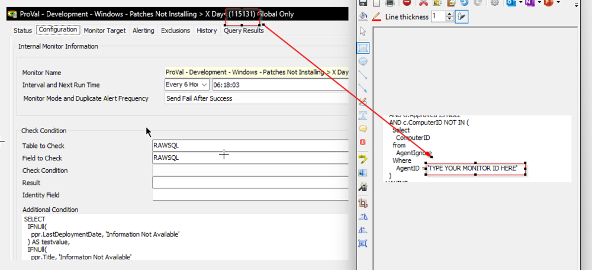
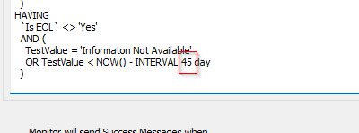
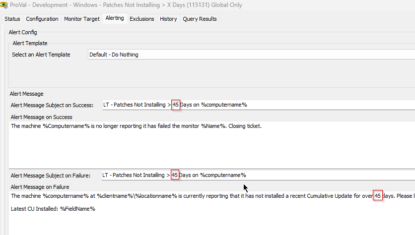

## Summary

The Purpose of this monitor set is to detect the machines that do have not any Cumulative/Security Patches installed in the past X days. It will not detect any EOL machine, and will only detect the machines where [CWM - Automate - Script - Windows Update Report [DV]](https://proval.itglue.com/DOC-5078775-10861682) script is executed even once over the past 7 days.

Suggested Alert Template: ~Custom - Ticket Creation Computer

Alerting Tab:

Subject: LT - Patches Not Installing > X Days on %computername%

Alert on Failure: The machine %computername% at %clientname%/%locationname% is currently reporting that it has not installed a recent Cumulative Update for over X days. Please look into why this machine is not getting patches. The last Cumulative Update for this machine was installed on %Result%.

%FieldName%

Alert on Success: The machine %Computername% is no longer reporting it has failed the monitor %Name%. Closing ticket.

NOTES:
1. Adjustment to the sql must be made at AgentID = 'TYPE YOUR MONITOR ID HERE' to make this functional.
   
2. To overwrite the default threshold of 45 days, following changes should be made:
   1. 45 in the INTERVAL 45 DAY statement at the bottom of the additional condition of the monitor set should be changed to the preferred number/day.
      
   2. In the Alerting tab, replace 45 with the desired threshold/day.
      

## Dependencies

- [EPM - Solution - Windows Update History Audit](https://proval.itglue.com/DOC-5078775-12275092)
- [SEC - Windows Patching - Custom Table - plugin_proval_windows_os_support](https://proval.itglue.com/DOC-5078775-7780690)
- [CWM - Automate - Script - Ticket Creation - Computer](https://proval.itglue.com/DOC-5078775-9098338)

## Target

SQL is limiting it to the machines with Managed patching policy only.

## Reference Table

- pvl_windows_updates
- plugin_proval_windows_os_support
- Computers
- Clients
- Locations
- Agentcomputerdata
- h_scripts
- AgentIgnore
- lt_scripts
- installsoftwarepolicies
- hotfixdata
- hotfix
- computerpatchpolicies

