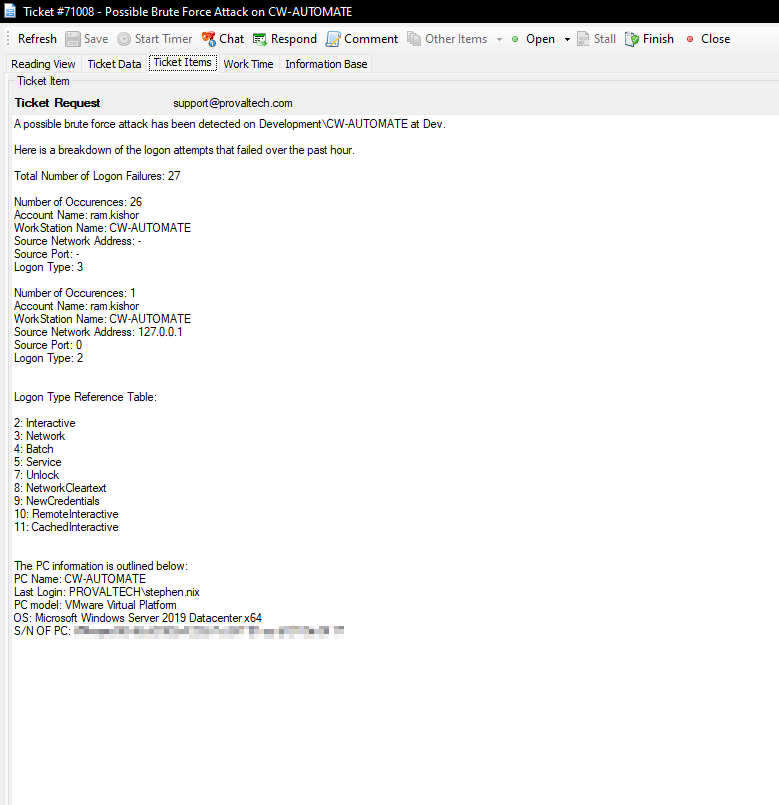
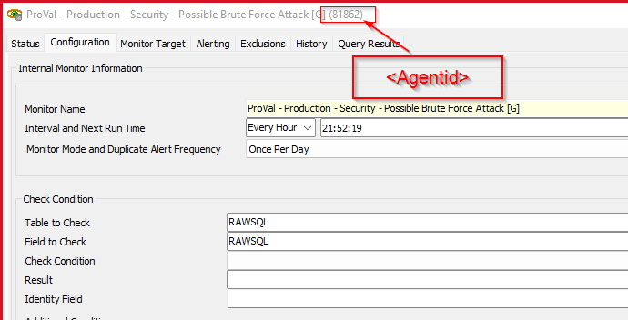

## Summary

This document checks the event log database table where the source event is Microsoft-Windows-Security-Auditing and `eventid = 4625`. It identifies instances where the count of occurrences is greater than 10 in the last 60 minutes.

**Alert Template:** ~Custom - Ticket Creation Computer

**Ticket Subject:** Possible Brute Force Attack on %computername%

**Alert Message on Success:** There are no potential brute force or logon failures detected in the last hour on %CLIENTNAME%%COMPUTERNAME% at %LOCATIONNAME%.

**Alert Message on Failure:**

A possible brute force attack has been detected on %CLIENTNAME%/%COMPUTERNAME% at %LOCATIONNAME%. 

Here is a breakdown of the logon attempts that failed over the past hour:

**Total Number of Logon Failures:** @RESULT@

@FIELDNAME@

**Logon Type Reference Table:**  
- 2: Interactive  
- 3: Network  
- 4: Batch  
- 5: Service  
- 7: Unlock  
- 8: NetworkCleartext  
- 9: NewCredentials  
- 10: RemoteInteractive  
- 11: CachedInteractive  

**Sample Ticket:**  

## Target

**Servers:** Domain Controllers

## Implementation  

1. Import the monitor set.  
2. Import the Alert Template (~Custom - Ticket creation computer), if it is not already present.  
3. Replace `\<agentid>` in the additional condition with the ID of your monitor set.  

## Dependencies

[CWM - Automate - Script - Ticket Creation - Computer](<../scripts/Ticket Creation - Computer.md>)

