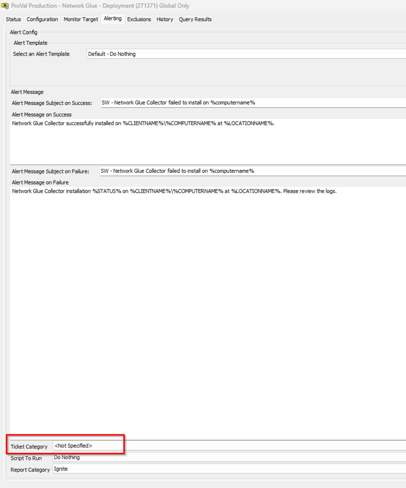

## Summary

This monitor performs the auto deployment of the Network Glue Collector. It depends on the EDFs mentioned in the document for the deployment.

## Dependencies

[Script - Network Glue Connector - Install](https://proval.itglue.com/DOC-5078775-9360868)

## EDFs

| Name                        | Level   | Type  | Editable | Description                                                                                                                         |
|-----------------------------|---------|-------|----------|-------------------------------------------------------------------------------------------------------------------------------------|
| Network Glue Activation Key  | Client  | Text  | Yes      | This is required to be set with the Individual Clients' Activation key found in their IT Glue Networks page to set the auto deployment |
| Network Glue Deployment      | Client  | Flag  | Yes      | This check box at the client level is needed to allow the deployment of the Network Glue collector to the endpoints of the client     |
| Network Glue Exclusion       | Location| Flag  | Yes      | This check box at the location level will exclude the deployment of the Network Glue collector to the endpoints of the location       |
| Network Glue Exclusion       | Computer| Flag  | Yes      | This check box at the computer level will exclude the deployment of the Network Glue collector from the endpoint.                    |

## Target

Windows Machines

## Ticketing

**_To enable ticketing please set the ticket category in the monitor_**  
  
**_The Script will then handle the ticket creation_** [ - Network Glue Connector - Install](https://proval.itglue.com/DOC-5078775-9360868)

