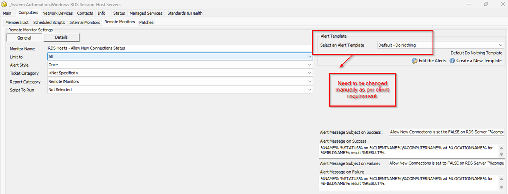

## Implementation Steps

- Run this SQL query from a RAWSQL monitor set to create the alert template.

```
#Insert Role
INSERT IGNORE INTO `roledefinitions` (`RoleName`, `RoleType`, `RoleSubType`, `DetectionString`, `ComparisonOperator`, `ComparisonResult`, `SerialKeyString`, `ProductKeyString`, `RoleDetectionGuid`, `IsRemote`, `SearchId`, `IsSupport`, `ParentRoleDefinitionGuid`, `OsType`) VALUES ('Windows RDS Session Host', 'Remote Desktop Services', 'Role', '', 'eq', 'True', '', '', '51b2cad8-14a3-11eb-bceb-0e924934e3ef', 1, 0, 0, '', 1);
```

```
#Insert Search
INSERT IGNORE INTO `sensorchecks` (`SensID`, `Name`, `SQL`, `QueryType`, `ListDATA`, `FolderID`, `GUID`, `SearchXML`, `UpdatedBy`, `UpdateDate`) VALUES (1406, 'Windows RDS Session Host Servers', 'SELECT //r//n   computers.computerid as `Computer Id`,//r//n   [computers.name](http://computers.name) as `Computer Name`,//r//n   [clients.name](http://clients.name) as `Client Name`,//r//n   computers.domain as `Computer Domain`,//r//n   computers.username as `Computer User`,//r//n   IFNULL(crd1.RoleDefinitionId,0) as `Windows RDS Session Host-1`//r//nFROM Computers //r//nLEFT JOIN inv_operatingsystem ON (Computers.ComputerId=inv_operatingsystem.ComputerId)//r//nLEFT JOIN Clients ON (Computers.ClientId=Clients.ClientId)//r//nLEFT JOIN Locations ON (Computers.LocationId=Locations.LocationID)//r//nLEFT JOIN ComputerRoleDefinitions crd1 ON (crd1.ComputerId=Computers.ComputerId And crd1.RoleDefinitionId=(Select RoleDefinitionId From RoleDefinitions Where RoleDetectionGuid=//'51b2cad8-14a3-11eb-bceb-0e924934e3ef//') And (crd1.Type=1 OR (crd1.CurrentlyDetected=1 and crd1.Type&lt;&gt;2)))//r//n WHERE //r//n((IFNULL(crd1.RoleDefinitionId,0) &gt;0 ))//r//n', 4, 'Select||=||=||=|^Select|||||||^', 0, '33b86301-043d-4268-90cd-cd91965d3b56', '&lt;LabTechAbstractSearch&gt;&lt;asn&gt;&lt;st&gt;AndNode&lt;/st&gt;&lt;cn&gt;&lt;asn&gt;&lt;st&gt;ComparisonNode&lt;/st&gt;&lt;lon&gt;Computer.LabTech.Roles&lt;/lon&gt;&lt;lok&gt;Computer.LabTech.Roles&lt;/lok&gt;&lt;lmo&gt;HasRole&lt;/lmo&gt;&lt;dv&gt;Windows RDS Session Host&lt;/dv&gt;&lt;dk&gt;51b2cad8-14a3-11eb-bceb-0e924934e3ef&lt;/dk&gt;&lt;/asn&gt;&lt;/cn&gt;&lt;/asn&gt;&lt;/LabTechAbstractSearch&gt;', NULL, NULL);
```

```
#Insert Group
SET @Searchid = (SELECT sensid from sensorchecks where `GUID` = '33b86301-043d-4268-90cd-cd91965d3b56') ;
SET @Parentid = (SELECT MIN(groupid) FROM mastergroups WHERE `Name` = '_System Automation') ;
SET @Parents = (SELECT CONCAT(',',MIN(groupid),',') FROM mastergroups WHERE `Name` = '_System Automation') ;
INSERT IGNORE INTO `mastergroups` (`GroupID`, `ParentID`, `Parents`, `Children`, `depth`, `Name`, `FullName`, `Permissions`, `Template`, `AutoJoinScript`, `Master`, `LimitToParent`, `Control`, `ControlID`, `Notes`, `MaintenanceID`, `MaintWindowApplied`, `GroupType`, `Priority`, `GUID`, `assetID`, `NetworkPermissions`, `NetworkJoin`, `NetworkJoinOptions`, `ContactPermissions`, `ContactJoin`, `ContactJoinOptions`) VALUES ('', @Parentid, ',@Parents,', ',', 1, 'Windows RDS Session Host Servers', '_System [Automation.Windows](http://automation.Windows) RDS Session Host Servers', 0, 0, @Searchid, 2, 1, 0, 0, '', 0, (NOW()), 4, 5, '86d05b2b-4bd2-11ee-955e-000c295e5f21', NULL, NULL, 0, 0, NULL, 0, 0);
```

```
#Insert Remote Monitor
SET @Groupid = (SELECT Groupid From MasterGroups where `GUID` =  '86d05b2b-4bd2-11ee-955e-000c295e5f21' ) ;
SET @Alertaction = (SELECT alertactionid FROM alerttemplate WHERE `GUID` = 'b69f8015-501e-4781-9e42-e23e0058bcd4') ;
```

```
INSERT IGNORE INTO `groupagents` (`AgentID`, `GroupID`, `SearchID`, `Name`, `CheckAction`, `AlertAction`, `AlertMessage`, `ContactID`, `interval`, `Where`, `What`, `DataOut`, `Comparor`, `DataIn`, `IDField`, `AlertStyle`, `ScriptID`, `datacollector`, `Category`, `TicketCategory`, `ScriptTarget`, `GUID`, `UpdatedBy`, `UpdateDate`) VALUES ('', @Groupid, 0, 'RDS Hosts - Allow New Connections Status', 6, 1, 'Allow New Connections is set to FALSE on RDS Server "%computername%" of Client: %clientname%~~~%NAME% %STATUS% on %CLIENTNAME%////%COMPUTERNAME% at %LOCATIONNAME% for %FIELDNAME% result %RESULT%.!!!Allow New Connections is set to FALSE on RDS Server "%computername%" of Client: %clientname%~~~%NAME% %STATUS% on %CLIENTNAME%////%COMPUTERNAME% at %LOCATIONNAME% for %FIELDNAME% result %RESULT%.', 0, 600, '127.0.0.1', '7', 'C:////Windows////System32////WindowsPowerShell////v1.0////powershell.exe -ExecutionPolicy Bypass -Command "$rdshSettings = Get-CimInstance -Namespace //'root////CIMv2////TerminalServices//' -Class Win32_TerminalServiceSetting -ComputerName ////"$env:computername/////";$allowNewConnections = $rdshSettings.AllowTSConnections;$allowNewConnections;if ($allowNewConnections -eq $false) {Write-Output ////"Allow new connections is set to FALSE on $env:computername//////"} else {Write-Output ////"Allow new connections is NOT set to FALSE on $env:computername//////"}"', 5, 'Allow new connections is NOT set to FALSE', '', 1, 0, '', 16, 0, 1, '52107a52-7a5b-4cc6-84ff-47ed9b68043c', 'root', (NOW());
```

- Note: This implementation step will create a role [RSM - Remote Desktop Services - Role - Windows RDS Session Host](https://proval.itglue.com/DOC-5078775-7970211), a search "Windows RDS Session Host Servers" bound with the above role, a group named "Windows RDS Session Host Servers" limited to the above search, and last the remote monitor [RDS Hosts - Allow New Connections Status](https://proval.itglue.com/DOC-5078775-13810738) will be created on the group with alert template "Default - Do Nothing".



- This needs to be changed to the "Default - Create Automate Ticket" or any other template that the client needs like emailing or ticket creation.


