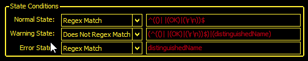
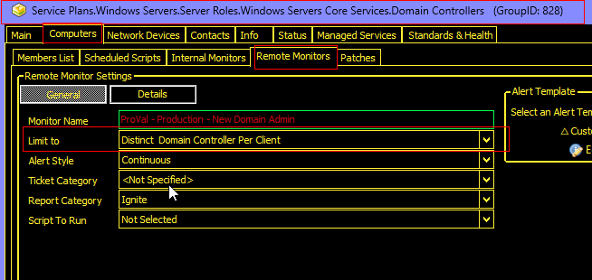

## Summary

The purpose of the remote monitor is to detect the newly created/promoted domain admins and create a ticket. It uses the [EPM - User Management - Agnostic - Get-NewDomainAdmin](https://proval.itglue.com/DOC-5078775-13410720) agnostic script to perform the monitoring.

## Details

**Suggested "Limit to"**: Primary Domain Controllers of Each Domain `<Distinct  Domain Controller Per Client>`  
**Suggested Alert Style**: Continuous  
**Suggested Alert Template**: △ Custom - Ticket Creation Computer - Failures Only  

Insert the details of the monitor in the below table.

| Check Action | Server Address | Check Type | Execute Info | Comparator | Interval | Result |
|--------------|----------------|------------|---------------|------------|----------|--------|
| System       | 127.0.0.1     | Run File   | **REDACTED**  | State Based | 3600     |  |

## Dependencies

[CWM - Automate - Script - Ticket Creation - Computer [Failures Only]*](https://proval.itglue.com/DOC-5078775-13459854)

## Target

Domain Controllers  


The monitor set should be limited to the `Distinct  Domain Controller Per Client` search.  


This search will create the remote monitor on a single domain controller of each domain.

## Implementation

Please follow the instructions provided in the implementation article to implement the solution:  
[Implement - Remote Monitor - New Domain Admin](https://proval.itglue.com/DOC-5078775-13460543)

## Ticketing

**Subject:** `New Domain Admin Detected at <DomainName>`

**Body:**  
```
New Domain Admin(s) Detected at %domain% for %clientname%.
<Newly Created Domain Admin(s)>
```

**Example:**  


**Automate will never close the ticket, instead, it will keep adding the new detections to the same ticket as a comment/note, unless the ticket is closed/resolved manually.**


