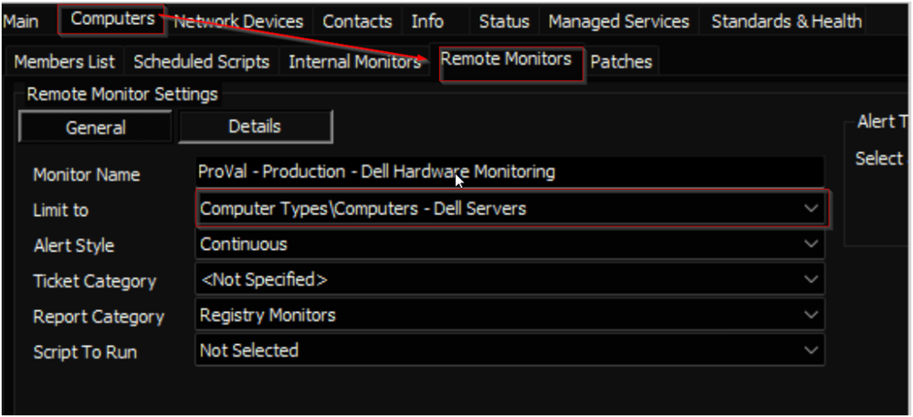

## Summary

This document describes how to monitor the event logs generated by the Dell OpenManage Server Administrator (OMSA) for Dell servers.

## Details

**Suggested "Limit to"**: Dell Servers  
**Suggested Alert Style**: Continuous  
**Suggested Alert Template**: `△ Custom - Ticket Creation Computer - Failures Only`

Insert the details of the monitor in the table below.

| Check Action | Server Address | Check Type | Execute Info | Comparator | Interval | Result |
|--------------|----------------|------------|---------------|------------|----------|--------|
| System       | 127.0.0.1      | Run File   | **REDACTED**  | State-Based | 3600     | Screenshot attached below |

## Dependencies

[Script - Ticket Creation - Computer [Failures Only]](<../scripts/Ticket Creation - Computer Failures Only.md>)

## Target

The remote monitor should be limited to the `Computers - Dell Servers` search on the **Managed Servers** service plan group(s).

## Ticketing

**Subject:** Dell OMSA Alert for: %CLIENTNAME%/%COMPUTERNAME%

**Failure Body:** Dell OpenManage has detected an issue with %Computername% at %clientname%. The message details are outlined below:  
%RESULT%

**Success Body:** No Dell hardware alerts were detected in the last 60 minutes.

## Implementation

[Implement - Remote Monitor - Dell Hardware Monitoring](<./Implement-%20Dell%20Hardware%20Monitoring.md>)