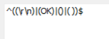

## Summary

This remote monitor checks Active Directory users' login password age to see if the age is set to unlimited. If so, it will change the user password from never expire to expire and will also change the Default Domain Policy password age to 90 days. It outputs the users whose password age is set to never expire and notes if the monitor fails to change the password age.

## Details

**Suggested "Limit to"**: Server Role - AD - Infrastructure Master  
**Suggested Alert Style**: Once  
**Suggested Alert Template**: △ Custom - Ticket Creation - Computer  

Insert the details of the monitor in the table below.

| Check Action | Server Address | Check Type | Execute Info | Comparator | Interval | Result |
|--------------|----------------|------------|---------------|------------|----------|--------|
| System       | 127.0.0.1     | Run File   | **REDACTED**  | Regex Match | 86400    |  |

## Target

Domain Controllers

## Ticketing

**Subject:** `Failed to Reset AD Users Password Age on %Computername% at %Clientname%`  

**Success Body**: `No users found with Password Age set to Not Expire.`  

**Failure Body:**  
`Failed to Reset AD Users Password Age on %Computername% at %Clientname%. Password is still set to Not Expire on the below users: %RESULT`  

## How to Import

[Import - Remote Monitor - Reset AD Users Password Age](<./Import%20-%20Remote%20Monitor%20-%20Reset%20AD%20Users%20Password%20Age.md>)  