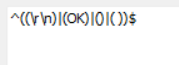

## Summary

This remote monitor checks the Local user's login password age to see if the age is set to unlimited, and if so it will change the user password from never Expire to expire and will also change the Default user policy password age to 90 days. It outputs the users whose password age is set to Never Expire and the monitor fails to change the password age.

## Details

**Suggested "Limit to"**: Windows Computers excluding Infrastructure Master  
**Suggested Alert Style**: Once  
**Suggested Alert Template**: △ Custom - Ticket Creation - Computer  

Insert the details of the monitor in the below table.

| Check Action | Server Address | Check Type | Execute Info | Comparator    | Interval | Result |
|--------------|----------------|------------|---------------|----------------|----------|--------|
| System       | 127.0.0.1     | Run File   | **REDACTED**  | Regex Match    | 86400    |  |

## Target

Windows Machines

## Ticketing

**Subject:** `Failed to Reset Local Users Password Age on %Computername% at %Clientname%`  

**Success Body**: `No users found with Password Age set to Not Expire.`  

**Failure Body:** `Failed to Reset Local Users Password Age on %Computername% at %Clientname%. Password is still set to Not Expire on below users:%RESULT%`  

## How to Import

[Import - Remote Monitor - Reset Local User Password Age](<./Import - Remote Monitor - Reset Local User Password Age.md>)

