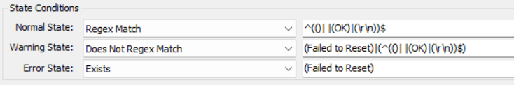

## Summary

The purpose of this remote monitor is to detect the maximum space allocated to VSS. If it exceeds 25% of the drive space, it will limit the maximum space to 5%.

## Details

**Suggested "Limit to"**: Windows OS  
**Suggested Alert Style**: Continuous  
**Suggested Alert Template**: △ Custom - Ticket Creation Computer  

Insert the details of the monitor in the table below.

| Check Action | Server Address | Check Type | Execute Info | Comparator   | Interval | Result                                             |
|--------------|----------------|------------|---------------|--------------|----------|---------------------------------------------------|
| System       | 127.0.0.1     | Run File   | **REDACTED**  | State Based  | 21600    |  |

## Target

Windows OS

## How To Import

[Implement - Remote Monitor - Reset System Restore Disk Space Usage](<./Implement-%20Reset%20System%20Restore%20Disk%20Space%20Usage.md>)
