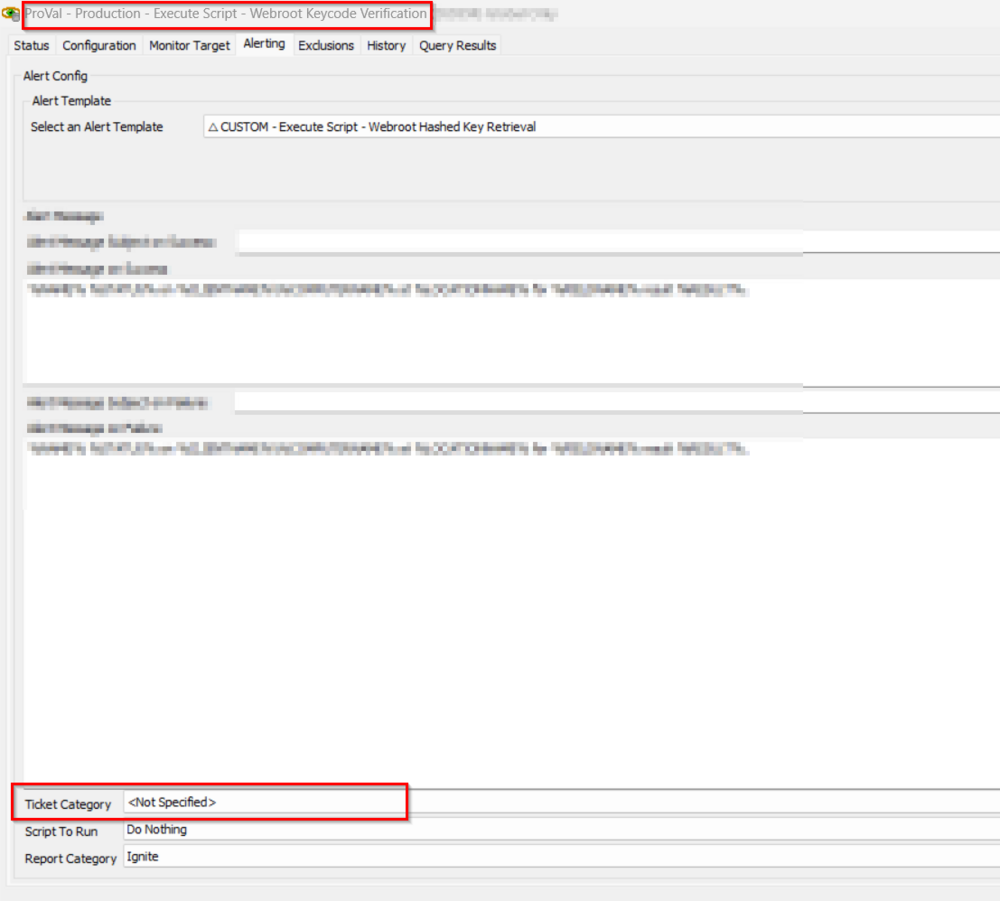

## Summary

This monitor checks for online agents where the script [EPM - Data Collection - Script - Webroot Keycode Verification](<../scripts/Webroot Keycode Verification.md>) has not run in the last 30 days, and ensures that the agent has Webroot installed and deployment enabled.

## Dependencies

- [EPM - Data Collection - Script - Webroot Keycode Verification](<../scripts/Webroot Keycode Verification.md>)

## Ticketing

- To set up ticketing for keycode mismatch detection, it is mandatory to set the ticket category in the monitor.  
  

## Target

- Global
