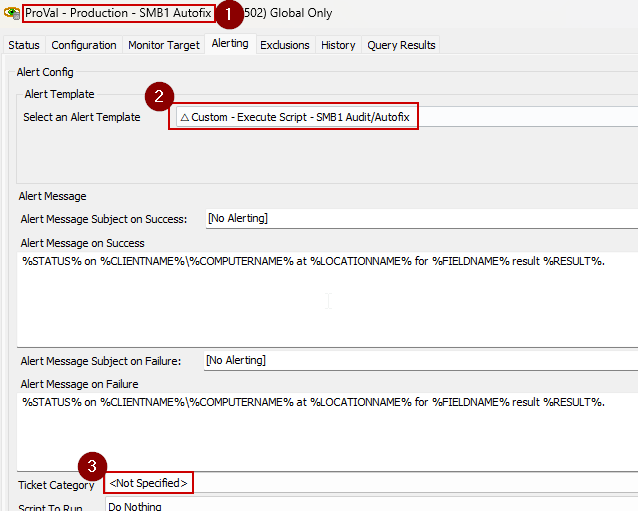

## Summary

This internal monitor detects online Windows agents and performs autofix on computers where the "Audit with Autofix" is set via client, location, or computer level EDF "SMB1 Vulnerability". The [Remote Monitor - SMB1 Detection](https://proval.itglue.com/DOC-5078775-17241874) shows failure, and the autofix [Script - SMBv1 Status Audit/Autofix [DV, Param]](https://proval.itglue.com/DOC-5078775-15811522) has not run in the past week.

## Dependencies

- [Remote Monitor - SMB1 Detection](https://proval.itglue.com/DOC-5078775-17241874)
- [Script - SMBv1 Status Audit/Autofix [DV, Param]](https://proval.itglue.com/DOC-5078775-15811522)

## Target

Global

## Ticketing

**_To enable ticketing, please set the ticket category in the monitor as shown below:_**

Once the ticket category is set, the Autofix [Script - SMBv1 Status Audit/Autofix [DV, Param]](https://proval.itglue.com/DOC-5078775-15811522) will automatically create a ticket to the service board using the ticket category set.

