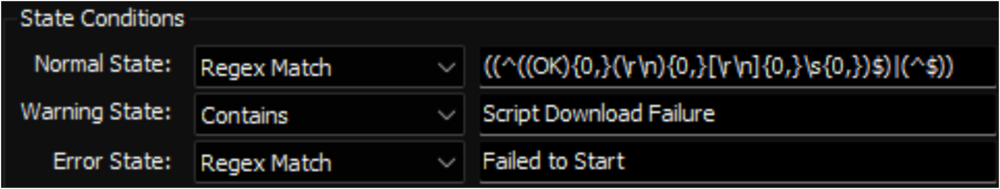
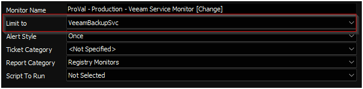

## Summary

This monitor will check the status of the `VeeamBackupSvc` service and restart it if it is not running. If it fails to start, it will identify all other services with names starting with `Veeam` that are not running, start those services, and then attempt to start `VeeamBackupSvc` again.

## Details

**Suggested "Limit to"**: VeeamBackupSvc  
**Suggested Alert Style**: Once  
**Suggested Alert Template**: `△ Custom - Ticket Creation - Computer`  

| Check Action | Server Address | Check Type | Execute Info | Comparator | Interval | Result |
|--------------|----------------|------------|---------------|-------------|----------|--------|
| System       | 127.0.0.1     | Run File   | **REDACTED**  | State Based | 300      |  |

## Dependencies

[EPM - Windows Configuration - Agnostic - Invoke-RestartService](<../../powershell/Invoke-RestartService.md>)

## Target

Managed Computers with the `VeeamBackupSvc` service.  
  

## Ticketing

**Subject**: `Veeam Service Monitor - Failed - %ComputerName%`  

**Body:**  
`Veeam Service Monitor failed on %CLIENTNAME%//%COMPUTERNAME% at %LOCATIONNAME%`  

`%RESULT%`  

**%RESULT%:**  
`Failed to start VeeamBackupSvc.`  
`Output of restarting Veeam* Services: \<Output of Restarting Veeam* Services>`  
`Output of restarting VeeamBackupSvc: \<Output of Restarting VeeamBackupSvc>`  

## Implementation

[Implement - Remote Monitor - Veeam Service Monitor](<./Veeam Service Monitor.md>)
