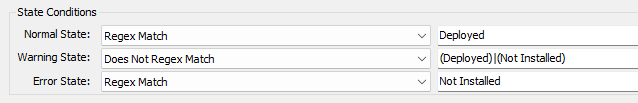

## Summary

The purpose of the script is to detect the computers missing the `Teams Machine-Wide Installer` application.

## Details

**Suggested "Limit to"**: Windows Workstations  
**Suggested Alert Style**: Once  
**Suggested Alert Template**: △ Custom - Execute Script - Winget - Install/Update - Teams  

Insert the details of the monitor in the below table.

| Check Action | Server Address | Check Type | Execute Info | Comparator | Interval | Result |
|--------------|----------------|------------|---------------|------------|----------|--------|
| System       | 127.0.0.1     | Run File   | `REDACTED`    | State Based| 86400    |  |

## Dependencies

[**EPM - Software Install - Script - Winget - Install/Update - Teams**](https://proval.itglue.com/DOC-5078775-13496687)  

## Target

Managed Windows Workstations

## Alert Template

**Name**: `△ Custom - Execute Script - Winget - Install/Update - Teams`  

**Note**: The [**EPM - Software Install - Script - Winget - Install/Update - Teams**](https://proval.itglue.com/DOC-5078775-13496687) script should be imported prior to creating/importing the alert template; since the alert template should run this script on failures.  

## Implementation

Follow the steps provided in this private document to implement the solution:  
[**Implement - Remote Monitor - Deploy Teams**](https://proval.itglue.com/DOC-5078775-13497993)  

