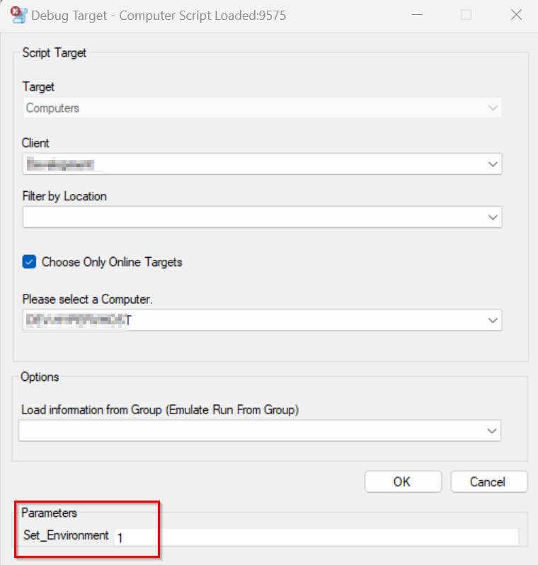
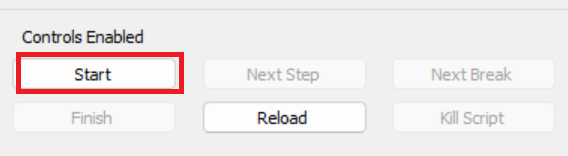
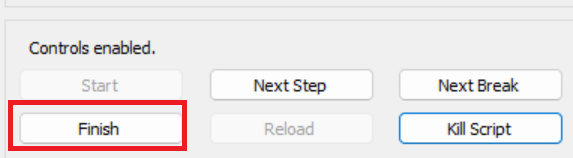
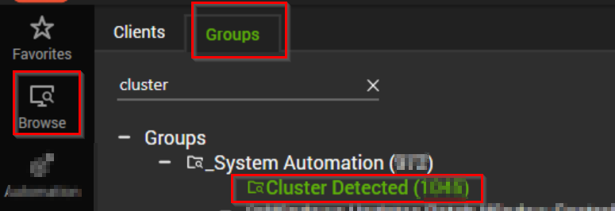
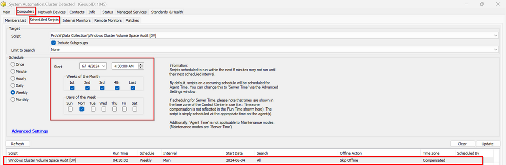

## Purpose

This solution is built to monitor the Windows Cluster Shared volume, create tickets if the cluster volume space goes below 10%, and perform the audit to keep a report of the cluster disk spaces on the HyperV Cluster servers.

## Auditing Content

| Content                                                                 | Type     | Function                                                                                                           |
|-------------------------------------------------------------------------|----------|--------------------------------------------------------------------------------------------------------------------|
| [Script - Windows Cluster Volume Space Audit [DV]](https://proval.itglue.com/DOC-5078775-15952791) | Script   | This script is created to audit the Cluster group devices to maintain a report of the space free at the cluster disks. |
| [Dataview - Windows Cluster Volume Space Audit [Script]](https://proval.itglue.com/DOC-5078775-15952792) | Dataview | This dataview is built to show the cluster disk space audit report fetched from the table "pvl_cluster_volumes" where the script [CWA Script - Windows Cluster Volume Space Audit](https://proval.itglue.com/DOC-5078775-15952791) performs the audit. |

## Automation Content

| Content                                                                 | Type          | Function                                                                                                           |
|-------------------------------------------------------------------------|---------------|--------------------------------------------------------------------------------------------------------------------|
| [Remote Monitor - Windows Cluster Shared Volume Detection](https://proval.itglue.com/DOC-5078775-15952794) | Remote Monitor | This monitor will detect the cluster volumes where the cluster disk space is below 10% as an error and between 10 and 20% as a warning. |
| [Script - Windows Cluster Shared Volume [Autofix,Ticket]](https://proval.itglue.com/DOC-5078775-15952795) | Script        | This function script runs as an Autofix with the remote monitor [CWA Remote Monitor - Windows Cluster Shared Volume Detection](https://proval.itglue.com/DOC-5078775-15952794) to create the ticket with detailed info about the cluster disk where the free space is below the threshold. It also calls the script [CWA Script - Windows Cluster Volume Space Audit](https://proval.itglue.com/DOC-5078775-15952791) to perform the space audit after the autofix script schedule to ensure the latest data is captured for that cluster server. |
| **△ CUSTOM - Execute Script - Windows Cluster Shared Volume**           | Alert Template | This alert template is designed to run the autofix script [Script - Windows Cluster Shared Volume](https://proval.itglue.com/DOC-5078775-15952795) with the remote monitor [Remote Monitor - Windows Cluster Shared Volume Detection](https://proval.itglue.com/DOC-5078775-15952794). |

## Additional Content

| Content                                                                 | Type          | Function                                                                                                           |
|-------------------------------------------------------------------------|---------------|--------------------------------------------------------------------------------------------------------------------|
| [Import - Remote Monitor - Windows Cluster Shared Volume Detection](https://proval.itglue.com/DOC-5078775-15952816) | Import Content | This content assists in importing the remote monitor using the provided query.                                    |
| [CWA Custom Table - pvl_cluster_volumes](https://proval.itglue.com/DOC-5078775-13808169) | Table         | The purpose of this table is to store the audit report of the cluster disk space on the HyperV cluster servers.   |

## Implementation

### Auditing

1. Import the following content using the ProSync Plugin:
   - [Script - Windows Cluster Volume Space Audit [DV]](https://proval.itglue.com/DOC-5078775-15952791)
   - [Dataview - Windows Cluster Volume Space Audit [Script]](https://proval.itglue.com/DOC-5078775-15952792)

2. Reload the system cache:
   

3. Configure the Audit script by following the below steps:
   - Navigate to Automation -> Scripts.
   - Open the script "Windows Cluster Volume Space Audit [DV]" and click debug.
   - Select any random client and computer.
   - Set the value of the Set_Environment Parameter to 1 and click OK.  
   
   - Once the debugger screen opens, click Start and Finish.  
     
   
   - Once the script is completed successfully, Click OK.

4. Reload the system cache:
   

5. Navigate to Browse -> Groups -> _System Automation -> Cluster Detected. Launch it by double-clicking on it.  
     
   Navigate to Computers -> Scheduled Scripts.  
   It should show the below schedule of the "Windows Cluster Volume Space Audit [DV]" script:  
   

### Alerting

1. Import the following content using the ProSync Plugin:
   - [Script - Windows Cluster Shared Volume [Autofix,Ticket]](https://proval.itglue.com/DOC-5078775-15952795)
   - Follow the [Import - Remote Monitor - Windows Cluster Shared Volume Detection](https://proval.itglue.com/DOC-5078775-15952816) documentation to create the remote monitor [Remote Monitor - Windows Cluster Shared Volume Detection](https://proval.itglue.com/DOC-5078775-15952794).
   - Alert Template - △ CUSTOM - Execute Script - Windows Cluster Shared Volume.

2. Reload the system cache:
   

3. Configure the solution as outlined below:
   - Navigate to Browse -> Groups -> _System Automation -> Cluster Detected.
   - Double-click the Cluster Detected group -> Computers -> Remote Monitors -> Windows Cluster Shared Volume Detection  
     - Set up with alert template `△ CUSTOM - Execute Script - Windows Cluster Shared Volume`.

> Note: The autofix [Script - Windows Cluster Shared Volume [Autofix,Ticket]](https://proval.itglue.com/DOC-5078775-15952795) also calls the [Script - Windows Cluster Volume Space Audit [DV]](https://proval.itglue.com/DOC-5078775-15952791) whenever the cluster volume space is detected below 20% as a warning or below 10% as an error. So, this maintains the fresh audit report for the ones we need to keep an eye on.

