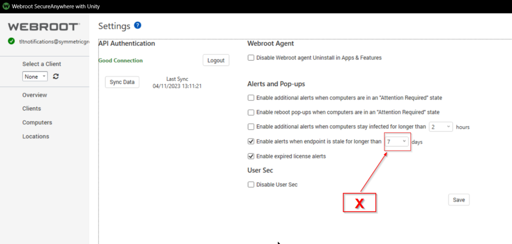
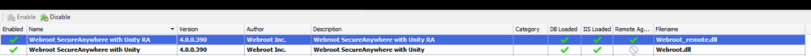

## Summary

The purpose of the monitor set is to detect the machines that are active in Automate but are not checking in with the Webroot portal for **X** number of days.  
**X** should be defined in the **Webroot SecureAnywhere with Unity** Plugin's settings.  
  

Preferred Alert template: △ Custom - Ticket Creation - Computer

## Dependencies

**Webroot SecureAnywhere with Unity Plugin**  
  

## Target

Global

## Ticketing

**Subject:**  
```
Webroot - Stale Agents detected on %COMPUTERNAME%
```

**Message on Failure:**  
```
A stale webroot agent has been detected on %CLIENTNAME%//%COMPUTERNAME% at %LOCATIONNAME%. A webroot stale agent means that although the machine is online and functioning, it is not reporting into the webroot console like it is expected. 

Last Seen by Webroot: %FIELDNAME%
Last Seen by Automate: %RESULT%
```

**Message on Success:**  
```
The computer %CLIENTNAME%//%COMPUTERNAME% at %LOCATIONNAME% has cleared the webroot stale agent detection monitor. This either means the machine has been offline for 7+ days or the problem is completely resolved. Closing ticket.
```


