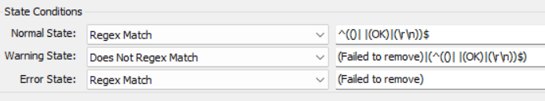

## Summary

The purpose of the remote monitor is to remove the `Anydesk` from the Windows machines.

## Details

**Suggested "Limit to"**: windows OS  
**Suggested Alert Style**: once  
**Suggested Alert Template**: △ Custom - Ticket Creation Computer  

Insert the details of the monitor in the below table.

| Check Action | Server Address | Check Type | Execute Info | Comparator    | Interval | Result |
|--------------|----------------|-------------|---------------|----------------|----------|--------|
| System       | 127.0.0.1     | Run File    | **REDACTED**  | State Based     | 3600     |  |

## Target

Windows OS

## Ticketing

**Subject**: - `Anydesk Removal Failed on %CLIENTNAME%/%COMPUTERNAME%`  

**Ticket Body**: - `Failed to remove Anydesk on %CLIENTNAME%/%COMPUTERNAME%`

## How To Import

[Implement - Remote Monitor - Uninstall Anydesk](https://proval.itglue.com/DOC-5078775-14007940)

