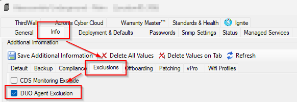
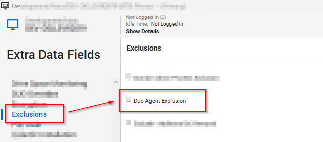

## Summary

The purpose of this monitor is to detect Windows machines with Duo installed on them, where the EDF `Duo Agent Exclusion` is opted at the client, location, or computer level.

**Note:** *The same EDFs are also being used in the [SWM - Software Install - DUO Install/Upgrade - Latest Version](<../scripts/DUO InstallUpgrade - Latest Version.md>). Selecting these EDFs will exclude the agent from DUO deployment and will also uninstall DUO from the machine if it is already installed.*

## Dependencies

| Name                    | Level    | Type     | Section     | Description                                                                                           |
|-------------------------|----------|----------|-------------|-------------------------------------------------------------------------------------------------------|
| DUO Agent Exclusion     | Client   | Checkbox | Exclusions  | Select this EDF to remove DUO from all machines under the Client.  |
| DUO Agent Exclusion     | Location | Checkbox | Exclusions  | Select this EDF to remove DUO from all machines under the location.  |
| DUO Agent Exclusion     | Computer | Checkbox | Exclusions  | Select this EDF to remove DUO from the selected machine only.  |

## Target

Global

## Alert Template

△ Custom - Execute Script - Uninstall DUO

