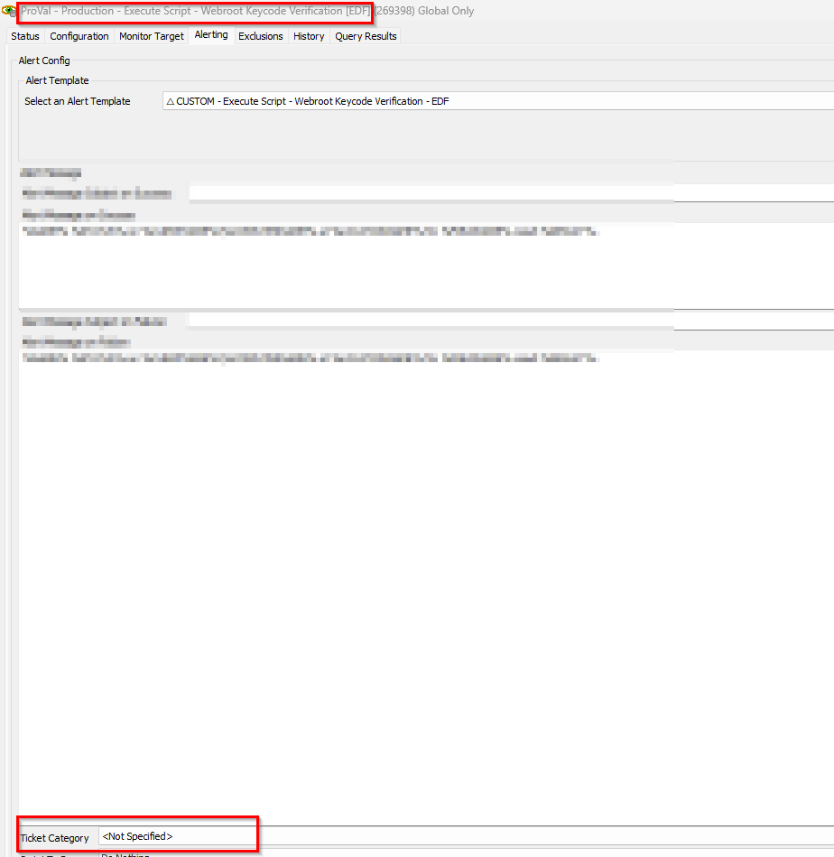

## Summary

This monitor checks the online agent where the script [EPM - Data Collection - Script - Webroot Keycode Verification [EDF]](https://proval.itglue.com/DOC-5078775-14989420) has not run in the last 30 days and the agent has Webroot installed and the deployment enabled.

## Dependencies

- [EPM - Data Collection - Script - Webroot Keycode Verification [EDF]](https://proval.itglue.com/DOC-5078775-14989420)
- EDFs:
  - Enable Webroot Deployment - Computer EDF
  - Exclude Webroot Deployment - Location EDF
  - Exclude Webroot Deployment - Client EDF

## Ticketing

- To set up the ticketing for the keycode mismatch detection it is mandatory to set the ticket category in the monitor.

## Target

- Global

