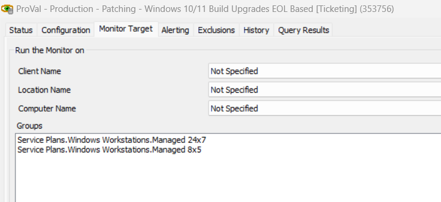

## Summary

This monitor is intended to be used for **ticketing purposes only**. It is explicitly excluding the machines with an open failure ticket generated by the [EPM - Windows Configuration - Script - Install Windows Upgrade](https://proval.itglue.com/DOC-5078775-12028460) script and generates a ticket for the computer that is failing to upgrade due to multiple reasons, like if it was offline or requires manual intervention, etc.

Alert Template - △ Custom - Ticket Creation - Computer

## Dependencies

- [EPM - Windows Configuration - Script - Install Windows Upgrade](https://proval.itglue.com/DOC-5078775-12028460)
- [Custom Table - plugin_proval_windows_os_support](https://proval.itglue.com/DOC-5078775-7780690)
- [EPM - Windows Patching - Internal Monitor - Windows 10/11 Build Upgrades EOL Based](https://proval.itglue.com/DOC-5078775-11563441)

## Target

Managed Service Plan Groups for Windows Workstations

## Ticketing

**Subject:**  
- UPDATES - Windows Build EoL on %computername% (%result%)

**Body:**  
- **Failure Message:**  
  The machine %COMPUTERNAME% located at %CLIENTNAME%//%LOCATIONNAME% has been reported to be on the %result% build and needs to be looked at manually. Typically, if this ticket generates, it means the machine has not been online during the nightly maintenance and requires manual scheduling or, occasionally, problems can occur with the automation that require the upgrade to be manually troubleshot on the machine physically. Please look into why this agent does not appear to be getting the build upgrade.

- **Success Message:**  
  The machine %COMPUTERNAME% located at %CLIENTNAME%//%LOCATIONNAME% is no longer reported to be on a EoL build or has been offline for greater than 7 days since the ticket was generated. Closing ticket.

