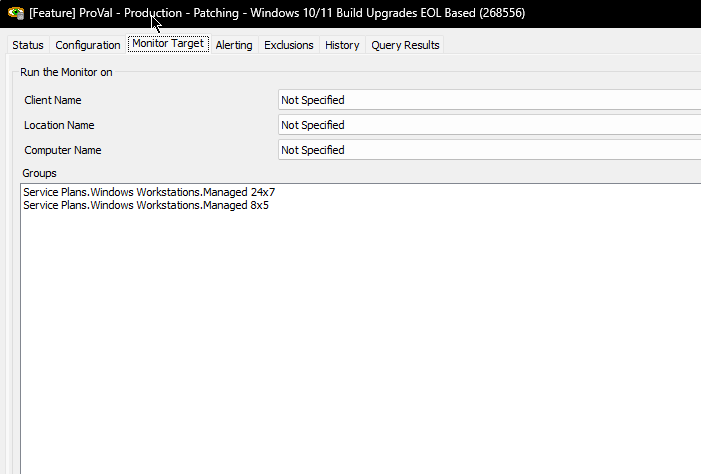
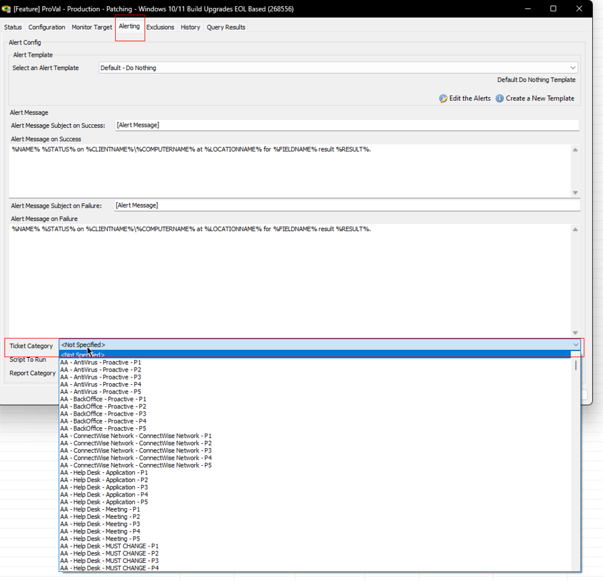

## Summary

This internal monitor identifies Windows 10 and Windows 11 machines that are EOL or will be EOL within the next six months. It is recommended to schedule it overnight once per day. This monitor can be set up with the '△ Custom - Autofix - Initiate Windows 10/11 Build Upgrade' Alert Template.

It explicitly excludes machines with an open failure ticket generated by the [EPM - Windows Configuration - Script - Install Windows Upgrade](<../scripts/Install Windows Upgrade.md>) script.

It also excludes machines where the [EPM - Windows Configuration - Script - Install Windows Upgrade](<../scripts/Install Windows Upgrade.md>) script has been issued more than two times within the last 30 days.

## Dependencies

- [EPM - Windows Configuration - Script - Install Windows Upgrade](<../scripts/Install Windows Upgrade.md>)
- [Custom Table - plugin_proval_windows_os_support](<../tables/plugin_proval_windows_os_support.md>)

## Target

Managed Service Plan Groups for Windows Workstations

## Ticketing

The [EPM - Windows Configuration - Script - Install Windows Upgrade](<../scripts/Install Windows Upgrade.md>) script will only create a ticket for failures on the detected machine if a ticket category is selected in the Alerting tab of the monitor set.

