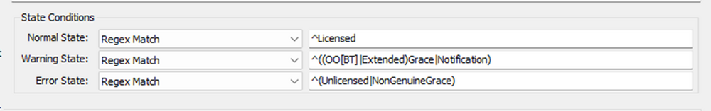

## Summary

This remote monitor Checks and Returns Windows License Status via CIMInstance.

## Dependencies

[Script - Ticket Creation - Computer](<../scripts/Ticket Creation - Computer.md>)

## Details

**Suggested "Limit to"**: Windows Machines - Excluding End-of-Life Windows Machines  
**Suggested Alert Style**: Once  
**Suggested Alert Template**: △ Custom - Ticket Creation Computer - Warning and Failed  

Insert the details of the monitor in the below table.

| Check Action | Server Address | Check Type | Execute Info | Comparator | Interval | Result               |
|--------------|----------------|------------|---------------|-------------|----------|----------------------|
| System       | 127.0.0.1     | Run File   | **REDACTED**  | Regex Match | 86400    | \<Screenshot Below>    |



## Target

The suggested target for the monitor is the managed service plans for Windows devices. (Example: Managed Workstations 24x7.) Please evaluate the best service plans where the monitor should be applied. It is recommended to include a "limit to" search for this remote monitor that excludes End of Life Windows Machines.

Windows Machines - Excluding End-of-Life Windows Machines.

**No guarantee for any machine with PowerShell Version older than 5.0**

## Ticketing

**Subject:** `Windows License Status FAILED on %COMPUTERNAME%`  

**Body:** Windows License Status for %COMPUTERNAME%: %Status% : %Result%  
Additional information on what each status means has been outlined below:

```
Normal Status:  
Licensed: This means that the Windows installation is licensed and activated.
```

```
Warning Status:
OOBGrace: This means that the Windows installation is in the Out-of-Box Grace period, which is a temporary license that allows you to use Windows for a limited time before activating the license.
OOTGrace: This means that the Windows installation is in the Out-of-Tolerance Grace period, which is a temporary license that allows you to use Windows for a limited time if the hardware configuration of the computer has changed significantly since the license was activated.
Notification: This means that the Windows installation is licensed and activated, but the license is about to expire or the product key has been blocked.
ExtendedGrace: This means that the Windows installation is in the Extended Grace period, which is a temporary license that allows you to use Windows for a limited time if the computer has been unable to contact the activation server.
```

```
Error Status:
Unlicensed: This means that the Windows installation is not licensed.
NonGenuineGrace: This means that the Windows installation is in the Non-Genuine Grace period, which is a temporary license that allows you to use Windows for a limited time if the license is suspected to be non-genuine or pirated.
```

## Implementation

[Import - Remote Monitor - Windows License Status](https://proval.itglue.com/DOC-5078775-15423273)

## FAQ

**Q: Receiving unwanted results?**  
A: Exclude the End of Life machines from monitoring.  

**Q: Not receiving alerts for warnings?**  
A: Ensure that the [CWM - Automate - Script - Ticket Creation - Computer](<../scripts/Ticket Creation - Computer.md>) script is up-to-date.  

**Q: How to opt out of Warning alerts?**  
A: Change the alert template on the group monitor to `△ Custom - Ticket Creation Computer`.


