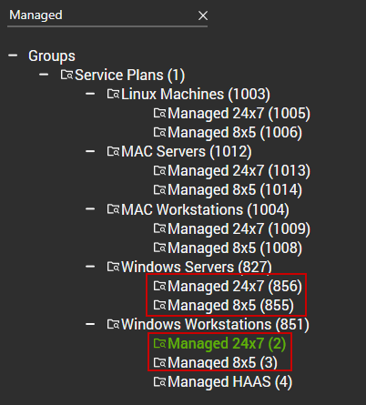

## Summary

The remote monitor is designed to clean up any '*.ps1' files older than 1 day located in the `C:/ProgramData/_Automation` directory. Since these scripts are often whitelisted by security applications, it is recommended to remove them from the system after they are run.

---

<u>This monitor will make a change to all systems it is deployed to</u>

 

---

<u><strong>What will change?</strong></u>  
This monitor will check X condition and make Y change.  
All PowerShell Files under the _automation directory that are older than 1 day will get deleted.

---

*This action will happen regardless of what alert template is set against the monitor.*  
*Monitors that make a change to the environment can be difficult to audit actions taken. Use with caution.*

## Details

**Suggested "Limit to"**: Managed Windows Machines  
**Suggested Alert Style**: Once  
**Suggested Alert Template**: Default - Do Nothing  

Insert the details of the monitor in the below table.

| Check Action | Server Address | Check Type | Execute Info | Comparator | Interval | Result |
|--------------|----------------|-------------|---------------|-------------|----------|--------|
| System       | 127.0.0.1     | Run File    | **REDACTED**  | Rexgex Match | 86400    | ((^((OK){0,}(//r//n){0,}[//r//n]{0,}//s{0,})$)|(^$)) |

## Target

Managed Windows Servers and Workstations  

## Implementation

[Import - Remote Monitor - _Automation Directory - Remove Obsolete .ps1 [Change]](https://proval.itglue.com/DOC-5078775-16732160)

