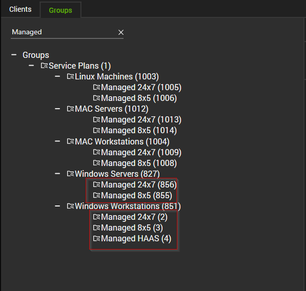

# Summary
The remote monitor is designed to clean up any `*.ps1` files older than 1 day located in the `C:\ProgramData\_Automation` directory. Since these scripts are often whitelisted by security applications, it is recommended to remove them from the system after they are run.

**Notes:** `Winget-AutoUpdate` directory and its subdirectories are excluded.

# Details
**Suggested "Limit to":** `Managed Windows Machines`

**Suggested Alert Style:** `Once`

**Suggested Alert Template:** `Default - Do Nothing`

# Implementation Steps

## Step 1
Obtain the group ID(s) of the group(s) that the remote monitor should be applied to. It is suggested to apply this monitor set to the Managed Windows Servers and Workstations groups.



## Step 2
Copy the following query and replace **YOUR COMMA SEPARATED LIST OF GROUPID(S)** with the Group ID(s) of the relevant groups:  
(The string to replace can be found at the very bottom of the query, right after **WHERE**)

```sql
INSERT INTO groupagents 
SELECT '' as `AgentID`,
`groupid` as `GroupID`,
'0' as `SearchID`,
'ProVal - Production - _Automation Directory - Remove Obsolete .ps1 [Change]' as `Name`,
'6' as `CheckAction`,
'1' as `AlertAction`,
'<No Alerts>~~~<No Alerts>!!!<No Alerts>~~~<No Alerts>' as `AlertMessage`,
'0' as `ContactID`,
'86400' as `interval`,
'127.0.0.1' as `Where`,
'7' as `What`,
'C:\\Windows\\System32\\WindowsPowerShell\\v1.0\\PowerShell.exe -ExecutionPolicy Bypass -command "$path = \'C:\\ProgramData\\_Automation\'; if ( Test-Path -Path $path ) { Get-ChildItem -Path $Path -Recurse | Where-Object { $_.CreationTime -lt (Get-Date).AddDays(-1) -and $_.Name -match \'\\.ps1$\' -and $_.Directory -notmatch \'Winget-AutoUpdate\' } | Remove-Item -Force -Confirm:$false -ErrorAction SilentlyContinue }"' as `DataOut`,
'10' as `Comparor`,
'((^((OK){0,}(\\r\\n){0,}[\\r\\n]{0,}\\s{0,})$)|(^$))' as `DataIn`,
'' as `IDField`,
'1' as `AlertStyle`,
'0' as `ScriptID`,
'' as `datacollector`,
'21' as `Category`,
'0' as `TicketCategory`,
'1' as `ScriptTarget`,
UUID() as `GUID`,
'root' as `UpdatedBy`,
(NOW()) as `UpdateDate`
FROM mastergroups m
WHERE m.groupid IN (YOUR COMMA SEPARATED LIST OF GROUPID(S))
AND m.groupid NOT IN (SELECT DISTINCT groupid FROM groupagents WHERE `Name` = 'ProVal - Production - _Automation Directory - Remove Obsolete .ps1 [Change]')
```

## Step 3
An example of a query with a group ID:

```sql
INSERT INTO groupagents 
SELECT '' as `AgentID`,
`groupid` as `GroupID`,
'0' as `SearchID`,
'ProVal - Production - _Automation Directory - Remove Obsolete .ps1 [Change]' as `Name`,
'6' as `CheckAction`,
'1' as `AlertAction`,
'<No Alerts>~~~<No Alerts>!!!<No Alerts>~~~<No Alerts>' as `AlertMessage`,
'0' as `ContactID`,
'86400' as `interval`,
'127.0.0.1' as `Where`,
'7' as `What`,
'C:\\Windows\\System32\\WindowsPowerShell\\v1.0\\PowerShell.exe -ExecutionPolicy Bypass -command "$path = \'C:\\ProgramData\\_Automation\'; if ( Test-Path -Path $path ) { Get-ChildItem -Path $Path -Recurse | Where-Object { $_.CreationTime -lt (Get-Date).AddDays(-1) -and $_.Name -match \'\\.ps1$\' -and $_.Directory -notmatch \'Winget-AutoUpdate\' } | Remove-Item -Force -Confirm:$false -ErrorAction SilentlyContinue }"' as `DataOut`,
'10' as `Comparor`,
'((^((OK){0,}(\\r\\n){0,}[\\r\\n]{0,}\\s{0,})$)|(^$))' as `DataIn`,
'' as `IDField`,
'1' as `AlertStyle`,
'0' as `ScriptID`,
'' as `datacollector`,
'21' as `Category`,
'0' as `TicketCategory`,
'1' as `ScriptTarget`,
UUID() as `GUID`,
'root' as `UpdatedBy`,
(NOW()) as `UpdateDate`
FROM mastergroups m
WHERE m.groupid IN (2,3,855,856)
AND m.groupid NOT IN (SELECT DISTINCT groupid FROM groupagents WHERE `Name` = 'ProVal - Production - _Automation Directory - Remove Obsolete .ps1 [Change]')
```

## Step 4
Now execute your query from a RAWSQL monitor set.

## Step 5
Locate your remote monitor by opening the group(s) remote monitors tab.

## Step 6
Do not apply any alert template to this remote monitor.