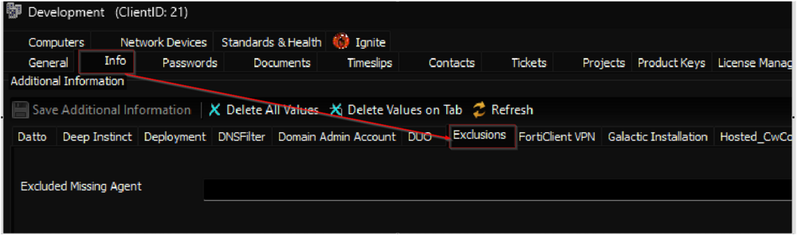
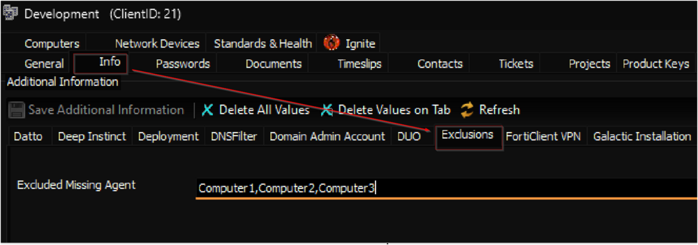

## Summary

The monitor set generates a client-level ticket containing details of domain-joined computers active within the domain, which have been joined to the domain for at least 7 days but do not have the Automate agent installed. This data is retrieved from the `Active Directory Browser plugin`, necessitating proper installation and configuration of the plugin to facilitate this monitoring process.

Client-level EDF `Excluded Missing Agent Computers` can be used to exclude the computer(s) from monitoring. Multiple computer names should be separated by commas (without any spaces).



Example: Adding `Computer1,Computer2,Computer3` to the EDF will exclude these machines from monitoring and from being fetched in the ticket.



## Additional Notes

Execute this SQL query from a `RAWSQL` monitor set to create the `EDF` before importing the monitor set from the ProSync plugin.

```
INSERT IGNORE 
    INTO `extrafield` 
        (`Form`, `Name`, `Sort`, `NoBreak`, `FType`, `Section`, `UnEditable`, `Collapsed`, `Fill`, `LtGuid`, `IsPassword`, `IsEncrypted`, `IsHidden`, `IsRestricted`, `ViewPermissions`, `EditPermissions`) 
    VALUES 
        (3, 'Excluded Missing Agent Computers', 0, 0, 0, 'Exclusions', 0, 0, '', 'c3e5dfe9-3950-4057-a37d-1e0555ac03ed', 0, 0, 0, 0, '', '');
CALL v_extradata(3, 'Clients'); 
CALL v_ExtraDataRefresh(3, 'Clients');
```

## Dependencies

[CWM - Automate - Ticket Creation - Client](/docs/eb53c8e9-ec2f-4efe-a36c-eeb3f8487981)

## Target

Global

## Alert Template

**Name:** `△ Custom - Ticket Creation - Client`

## Ticketing

**Subject:** `Detection of Missing Automate Agents in <Domain Name> Domain: <Number of Computers> Active Computers Identified`

**Body:**

```
Detection of Missing Automate Agents in <Domain Name> Domain: <Number of Computers> Active Computers Identified

Details of the computers that are missing the Automate agent: 

Computer Name: <Computer Name>
OS: <Operating System>
Creation Date: <Domain Joining Date>
Last Logon: <Last Logon Date>

Note: The list of machine names, separated by commas, can be configured within the client-level Extra Data Field (EDF) labeled "Excluded Missing Agent Computers" to exclude those machines from this monitoring process.
```

