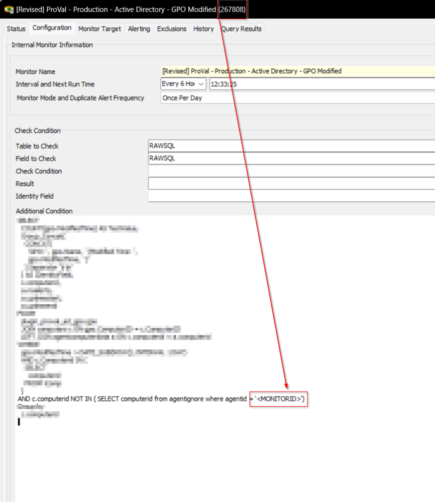
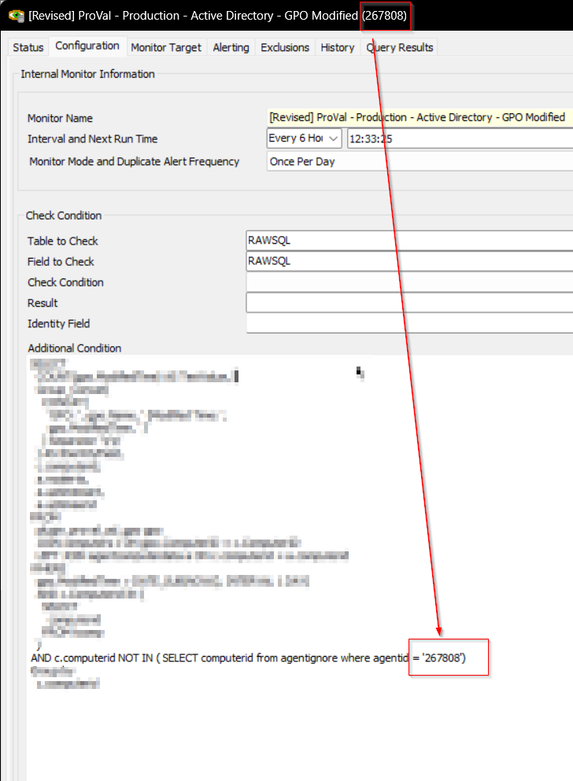
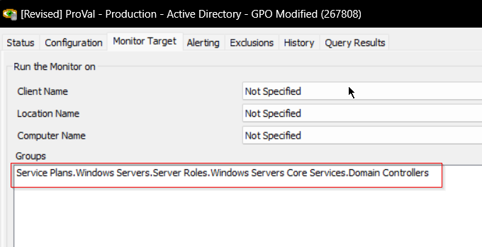
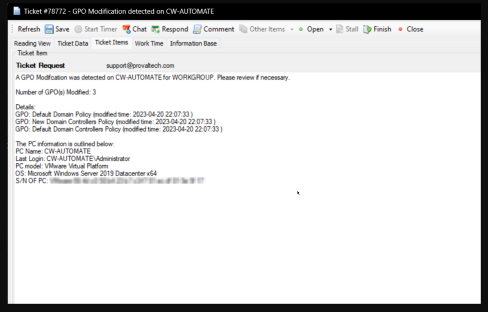

## Summary

This Custom RAWSQL monitor shows the GPO modified time on the computer if the GPO was modified in the last day.

## Implementation

- Replace `\\<MonitorID>` in the additional condition with the ID of the monitor set.  
    
    
- Ensure that the monitor set is targeted on the Domain Controllers group.  
    

## Dependencies

- [plugin_proval_ad_gpo](/docs/c7cf649a-dd80-4e9d-8c80-eb95b813b7c9)  
- [Group Policy Audit](/docs/2e5f5f2b-7c81-4aec-a76a-623a465f959a)

## Target

Domain Controller

## Alert Template

△ Custom - Ticket Creation - Computer

## Ticketing

**Subject:** `GPO Modification detected on %COMPUTERNAME%`

**Ticket Body:**  
```
A GPO modification was detected on %COMPUTERNAME% for %DOMAIN%. Please review if necessary.
Number of GPO(s) Modified: %RESULT%
Details:  
%FIELDNAME%
```

**%RESULT%:** Total number of modified GPOs  

**%FIELDNAME%:** GPO: `\\<Name of GPO>` (Modified Time: `\\<Modification Time of GPO>`)  

**Sample Ticket:**  
  


