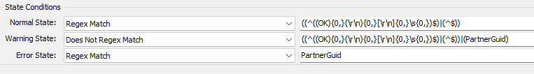
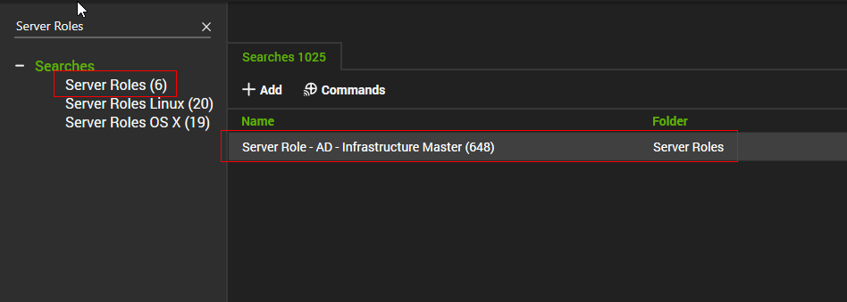

## Summary

The monitor set operates on a cluster of Primary Domain Controllers (Infrastructure Masters) for each domain, triggering a failure alert upon detecting any Active Directory Replication Failure.

**Note:** The monitor set is incompatible with servers running PowerShell versions older than 4.0.

## Details

**Suggested "Limit to":** `Server Role - AD - Infrastructure Master`  
**Suggested Alert Style:** Continuous  
**Suggested Alert Template:** `△ Custom - Ticket Creation Computer - Failures Only`

Insert the details of the monitor in the table below.

| Check Action | Server Address | Execute Info | Check Value | Condition     | Interval | Result |
|--------------|----------------|---------------|-------------|---------------|----------|--------|
| System       | 127.0.0.1     | Run File      | **REDACTED**| State Based    | 3600     |  |

## Target

**Group:** Domain Controllers  
  

**Search:** Server Role - AD - Infrastructure Master  
  

## Ticketing

**Subject:** `AD Replication Failure - %DOMAIN%`

**Body:**  
```
AD Replication Failure(s) have been identified for the domain '%DOMAIN%' within the previous hour. The details are provided below:
%RESULT%
For a precise understanding of the error codes returned in the `LastError` property, please consult the following article: [Common Active Directory Replication Errors](https://learn.microsoft.com/en-us/troubleshoot/windows-server/identity/common-active-directory-replication-errors)
```

## Implementation

[Implement - Remote Monitor - Active Directory Replication Anomaly Monitoring](/docs/495df667-0690-48e0-b929-f7671e9fc92c) 