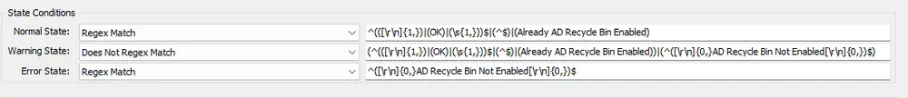

## Summary

This document describes a remote PowerShell monitor that detects whether the AD Recycle Bin is enabled or disabled on Windows Domain Controller (DC) servers.

## Details

**Suggested "Limit to"**: Windows Infrastructure masters  
**Suggested Alert Style**: Once  
**Suggested Alert Template**: △ Custom - Execute Script - AD - Enable AD Recycle Bin  

| Check Action | Server Address | Check Type | Comparator   | Interval | Result |
|--------------|----------------|-------------|--------------|----------|--------|
| System       | 127.0.0.1      | Run File    | State based   | 86400    |  |

## Dependencies

- [AD - Enable AD Recycle Bin](/docs/e80d5873-304e-4b12-b52c-b608a7715a9f)  
- [RSM - Active Directory - Role - AD Domain Recycle Bin Feature](/docs/01cb2977-8f3e-49fa-ad5b-62375c54a39c)  

## Target

Domain Controllers only.

## Implementation

- [Import - Remote Monitor - AD Recycle Bin State Check](/docs/7f37dfc1-5f0a-4f7d-bf9f-631ea653a74d) 