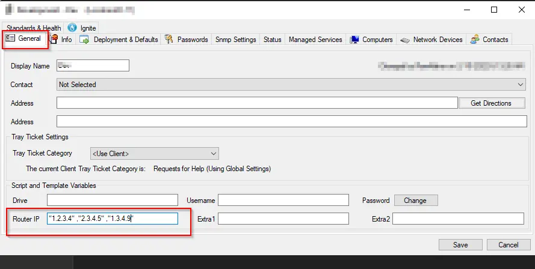
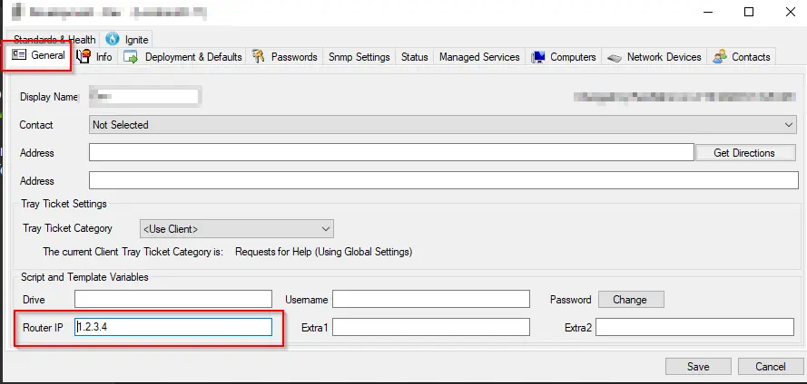

## Summary

The purpose of the monitor set is to detect computers that are placed in the wrong location. Location is verified based on the router address. The router IP for each location must be defined, and multiple router IPs can also be specified. A router address must be written in double quotes ("Router Address"). When using multiple router addresses, each address must be separated by a space and a comma ("Router Address 1", "Router Address 2", "Router Address n").

### Sample Screenshots

**Multiple Router Addresses:**

**Single Router Address:**

There is an option available in the monitor set to use router addresses without quotes; however, in that case, you will not be able to use multiple router addresses for any of the locations.

To use a single router address without quotes, you can uncomment the line `#ON FIND_IN_SET (a.routeraddress, b.scrouteraddress) <> 0` in the additional condition, followed by commenting the very next line.

**Single Unquoted Router Address:**

## Target

Global