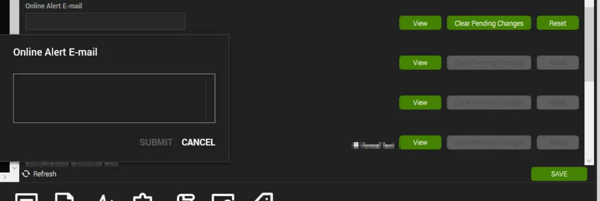

## Summary

This monitor will alert on any computer that has checked in within the last 5 minutes and has the 'Online Alert E-mail' ConnectWise Automate computer-level EDF filled out with a valid email address.

**Alert Template:** △ Custom - E-Mail - Machine Back Online

## Dependencies

[CWM - Automate - Script - Email - EDF - Machine Back Online [Autofix]](/docs/c32c5921-0bd1-4e4a-b605-baa0e958fbc0)

## Target

Global