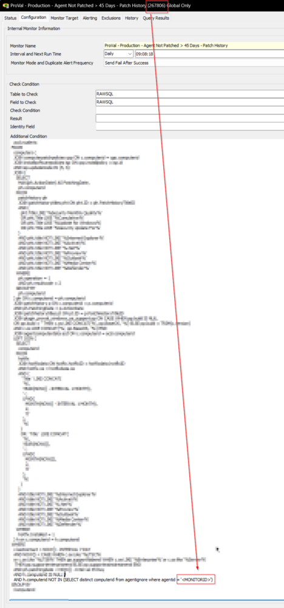
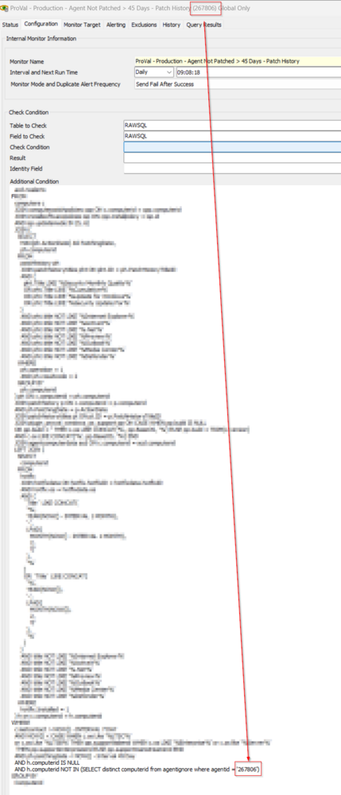

## Summary

The objective of this monitor set is to provide a comprehensive solution for detecting machines that have not installed Windows updates within the last 45 days. This will help ensure that all systems are up-to-date and protected against known security threats.

Only devices running Microsoft's supported operating systems will be detected by the monitor set, excluding those that are at the end of their life. It will also only monitor machines that have come online within the last 7 days to ensure that the data collected is current and relevant.

Moreover, it only applies to PCs that are patch-managed and using Automate's default `patchhistory` table.

## Implementation

Replace the word `\\<MonitorID>` in the additional condition with the actual monitor ID.





## Dependencies

- [SEC - Windows Patching - Custom Table - plugin_proval_windows_os_support](/docs/938cd822-f6a3-4ee3-add2-62b407e45622) 
- [CWM - Automate - Script - Ticket Creation - Computer](/docs/63beba3c-f4a6-41a5-98e2-d4e4ce885035)

## Target

SQL is limiting the results to the patch-managed supported Windows machines.

## Ticketing

**Subject:** `UPDATES - 45+ Days Since Last Patch Installed on %CLIENTNAME%/%COMPUTERNAME%`

**Failure Body:** 

```
We are currently reporting that it has been 45+ days since the machine %CLIENTNAME%/%COMPUTERNAME% has installed a patch. Sometimes Automate fails to update the patch history table correctly, so please verify if patching is actually having an issue or not.

The last update(s) seen to have been installed are shown below:
%FIELDNAME%
```

**Success Body:** 

```
Since this machine has fallen below the patching threshold, we are closing this ticket.
```

**%RESULT%:** `Number of days since the last Windows update was installed.`

**%FIELDNAME%:** `Title(s) of the last patch(es) installed on the computer.`

## AlertTemplate

```
△ Custom - Ticket Creation - Computer
```

