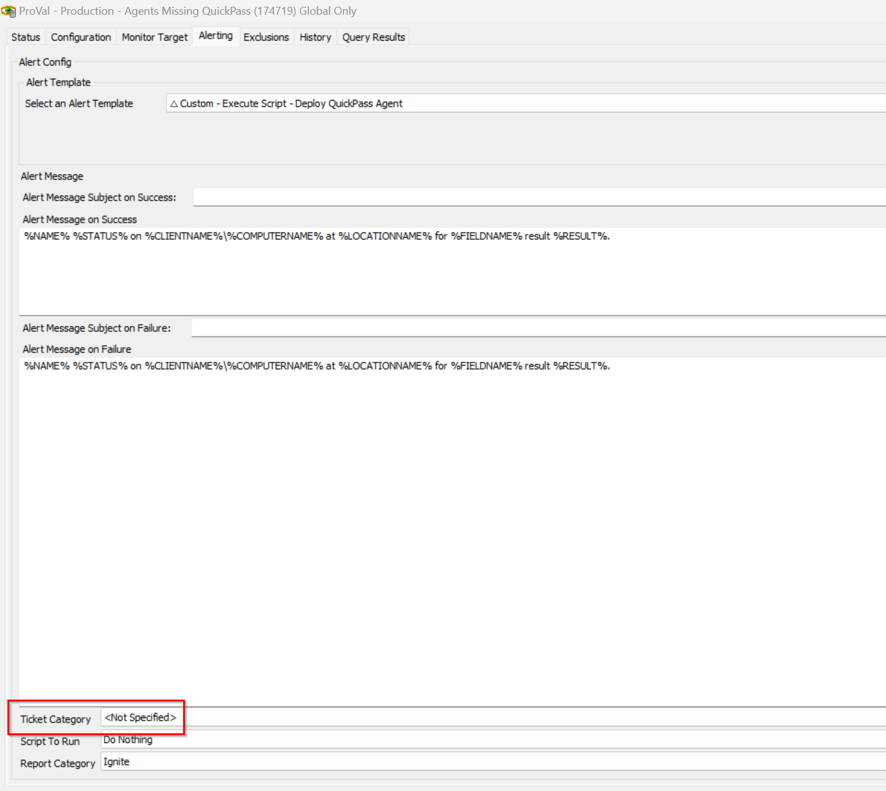

## Summary

Detects machines where `QuickPass Agent (64-bit)` is not installed and deployment is enabled. 

## Dependencies

- [Script - Deploy QuickPass Agent](/docs/ab838395-dc94-4ceb-986e-99d00b005198)
- [Solution - QuickPass Deployment](/docs/65d0dbb6-29c1-4242-841c-1da9b92edab6)

## Target

Global

## Alert Template

`△ Custom - Execute Script - Deploy QuickPass Agent`

## Ticket Creation

- Set the `TicketCategory` inside the Alerts of the monitor to allow the script to create ticket.

## Changelog

### 2026-03-06

- Adjusted the monitor to make it constrained and have it shorten by removing unnecessary joins.
- Added the check for the "QuickPass Agent ID" EDFs inside the monitor, if it is missing at the location or client-level then ignore agents.

### 2025-10-27

- Initial version of the document
  

