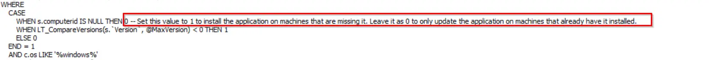

## Summary

This monitor is designed to update the application based on the PackageID, Source, and Application Name provided within the monitor. Please duplicate the monitor name and replace `<Application>` with the actual application name.

## Dependencies

- [Winget - Install/Update [Autofix, Param]](/docs/dd445ce7-a149-452c-9b35-dc1adbab4e06)
- [Update/Deploy Target Application to Latest Version Winget](/docs/2487a1f4-6f85-42f3-91d0-4aab8c875021)

## Target

Global - Should be run without explicitly defined targets.

This monitor depends on the property named PackageID being created. Therefore, before enabling it, you need to implement the monitor "ProVal - Production - `<Application>` - Latest Version Detection" with the alert template "△ Custom - Execute Script - Application Latest Version."

## FAQ

Does this monitor can perform installation as well?

By default, it only performs the update.
Yes, for the install enable please change the null value to 1 as shown below:

