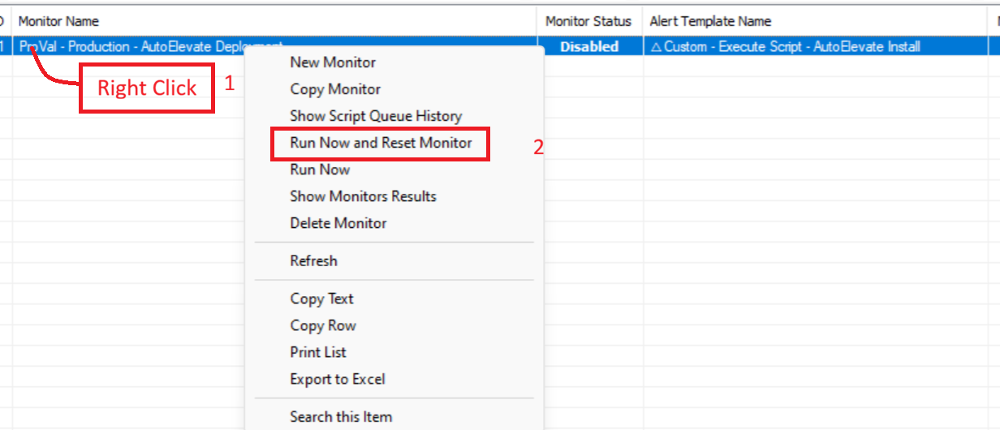
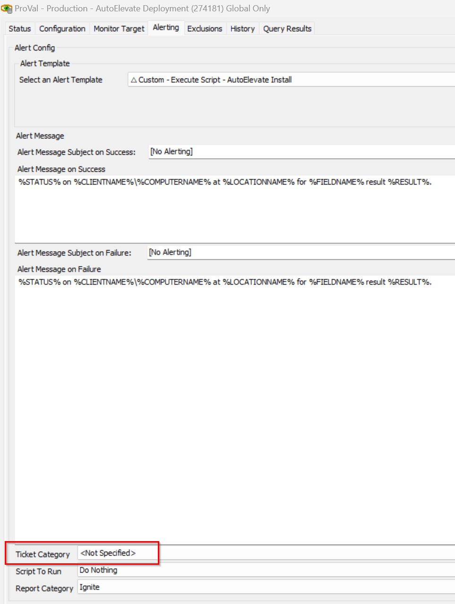

## Summary

This monitor helps to deploy the AutoElevate to the Windows and MAC agents.

## Dependencies

- [Script - AutoElevate Install - [MAC/Windows]](/docs/89cb899c-e0ea-438f-903e-0bea83eb8f6c)
- [Solution - AutoElevate Deployment](/docs/db76a502-1c00-4105-9458-a0530ddf5fe0)
- **Alert template -** `△ Custom - Execute Script - AutoElevate Install`

## Target

- Global

## Implementation

- Import the script [AutoElevate Install - [MAC/Windows]](/docs/89cb899c-e0ea-438f-903e-0bea83eb8f6c)
- Import the alert template `△ Custom - Execute Script - AutoElevate Install`
- Import the monitor [ProVal - Production - AutoElevate Deployment](/docs/5ef04731-9532-4b2c-b1fc-d18ad7d7a44e)
- Apply the alert template to the monitor and Save the monitor
- Right Click and select `Run Now and Reset Monitor`

Note: Ensure to set the EDFs at the client-level to allow it to pick the agents

## FAQ

**Q. Does this monitor can create ticket during installation failure?**
  
**A.** Yes, you just need to set the ticket category at the monitor level to receive the installation failure tickets.

  