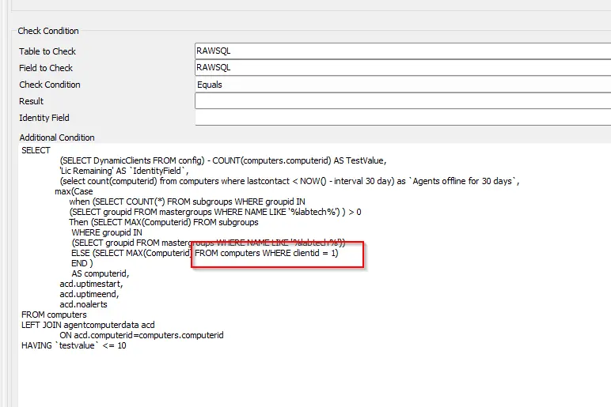

## Summary

This monitor will alert if there are fewer than 10 Automate licenses remaining.

The suggested alert template is **Default Create Automate Ticket**.

## Important Notes

For on-prem partners, tickets will be generated for the Automate server.  
For hosted partners, it will be the minimum `computerid` of `Clientid 1`. If `Clientid 1` is not the primary client for a hosted partner, then the `clientid` should be updated in the Additional Field:  

## Target

Global - Should be run without explicitly defined targets.