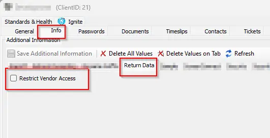
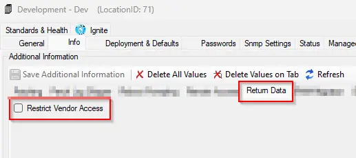
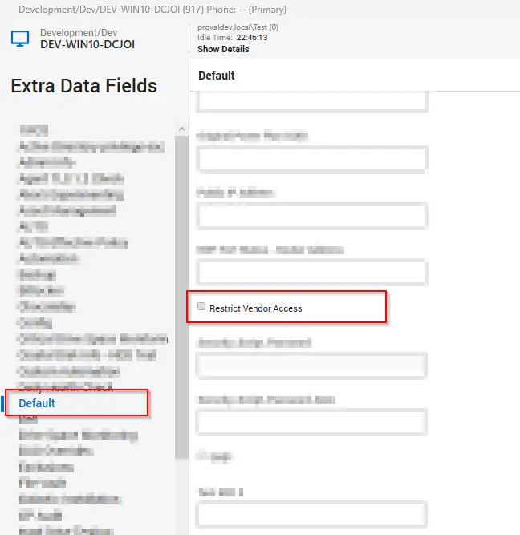

## Summary

The purpose of this monitor is to ensure that when the `Restrict Vendor Access` EDFs are checked within Automate, it automatically restricts the machines in both Automate and ScreenConnect. And if the EDF is unchecked but the custom property `Vendor Restricted` in ScreenConnect is set to `Restricted`, this will unrestrict the computer both in Automate and ScreenConnect.

## Dependencies

The following EDFs must be created before importing the monitor:

- **Client EDF**: `Restrict Vendor Access`   
Enables the vendor restriction for whole client  
  

- **Location EDF**: `Restrict Vendor Access`  
Enables the vendor restriction for whole location  
  

- **Computer EDF**: `Restrict Vendor Access`  
Enables the vendor restriction for the computer
  

## Target

All operating systems

## Alert Template

- `△ Custom - Execute Script - Update Vendor Restricted Property`