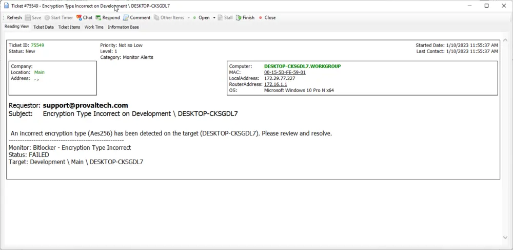

## Summary

This monitor will return any target machine whose client has the 'Bitlocker Monitoring' EDF checked, and the target's 'Bitlocker Monitoring Exclusion' is not checked, and its 'C' drive is listed as a mount point in 'plugin_proval_bitlocker_audit' under the following conditions:

- If the client level 'Bitlocker XTS-AES 256' EDF is checked and the value for Encryption Method is not NONE and not 'XtsAes256', then return that target.
- If the client level 'Bitlocker XTS-AES 256' EDF is not checked and the value for Encryption Method is not NONE and not 'Aes256', then return that target.

## Dependencies

- [SEC - Encryption - Custom Table - plugin_proval_bitlocker_audit](/docs/bb3eaac8-80f6-43b9-90f1-75886c06bf14)
- [SEC - Encryption - Solution - Bitlocker](/docs/f41e4d71-7074-4c28-8246-b8e3036c1212)

## Target

Please follow the recommended target for the Bitlocker solution.

## Translated SQL

```sql
SELECT 
   ppba.EncryptionMethod as TestValue,
   computers.name as IdentityField,
   computers.computerid,
   clients.name as `Client Name`,
   computers.domain as `Computer Domain`,
   computers.username as `Computer User`,
   IFNULL(IFNULL(edfAssigned1.Value,edfDefault1.value),'0') as `Computer - Client - Extra Data Field - Security Compliance - Bitlocker Monitoring`,
   IFNULL(IFNULL(edfAssigned2.Value,edfDefault2.value),'0') as `Computer - Extra Data Field - Security Compliance - Bitlocker Monitoring Exclusion`,
   IFNULL(IFNULL(edfAssigned3.Value,edfDefault3.value),'0') as `Computer - Client - Extra Data Field - Security Compliance - Bitlocker XTS-AES 256`,
   ppba.MountPoint,
   a.noalerts,
   a.uptimestart,
   a.uptimeend,
   computers.DateAdded
FROM Computers 
LEFT JOIN inv_operatingsystem ON (Computers.ComputerId=inv_operatingsystem.ComputerId)
LEFT JOIN Clients ON (Computers.ClientId=Clients.ClientId)
LEFT JOIN Locations ON (Computers.LocationId=Locations.LocationID)
LEFT JOIN plugin_proval_bitlocker_audit ppba ON computers.ComputerID = ppba.ComputerID
LEFT JOIN agentcomputerdata a ON computers.computerid = a.computerid
LEFT JOIN ExtraFieldData edfAssigned1 ON (edfAssigned1.id=Clients.ClientId and edfAssigned1.ExtraFieldId =(Select ExtraField.id FROM ExtraField WHERE `Name` = 'Bitlocker Monitoring'))
LEFT JOIN ExtraFieldData edfDefault1 ON (edfDefault1.id=0 and edfDefault1.ExtraFieldId =(Select ExtraField.id FROM ExtraField WHERE `Name` = 'Bitlocker Monitoring'))
LEFT JOIN ExtraFieldData edfAssigned3 ON (edfAssigned3.id=Clients.ClientId and edfAssigned3.ExtraFieldId =(Select ExtraField.id FROM ExtraField WHERE `Name` = 'Bitlocker XTS-AES 256'))
LEFT JOIN ExtraFieldData edfDefault3 ON (edfDefault3.id=0 and edfDefault3.ExtraFieldId =(Select ExtraField.id FROM ExtraField WHERE `Name` = 'Bitlocker XTS-AES 256'))
LEFT JOIN ExtraFieldData edfAssigned2 ON (edfAssigned2.id=Computers.ComputerId and edfAssigned2.ExtraFieldId =(Select ExtraField.id FROM ExtraField WHERE `Name` = 'Bitlocker Monitoring Exclusion'))
LEFT JOIN ExtraFieldData edfDefault2 ON (edfDefault2.id=0 and edfDefault2.ExtraFieldId =(Select ExtraField.id FROM ExtraField WHERE LTGuid='Bitlocker Monitoring Exclusion'))
WHERE 
((((IFNULL(IFNULL(edfAssigned1.Value,edfDefault1.value),'0') <> '0') AND (IFNULL(IFNULL(edfAssigned2.Value,edfDefault2.value),'0')='0')))) 
AND ( 
   (ppba.MountPoint = 'C:') 
   AND ( 
       CASE WHEN (IFNULL(IFNULL(edfAssigned3.Value,edfDefault3.value),'0') = '1') THEN 
       (ppba.`EncryptionMethod` != 'NONE' AND ppba.`EncryptionMethod` != 'XtsAes256') 
       ELSE (ppba.`EncryptionMethod` != 'NONE' AND ppba.`EncryptionMethod` != 'Aes256') 
       END 
   ) 
) AND ( 
       computers.DateAdded < DATE_SUB(NOW(), INTERVAL 7 DAY) 
)
```

## Ticketing



