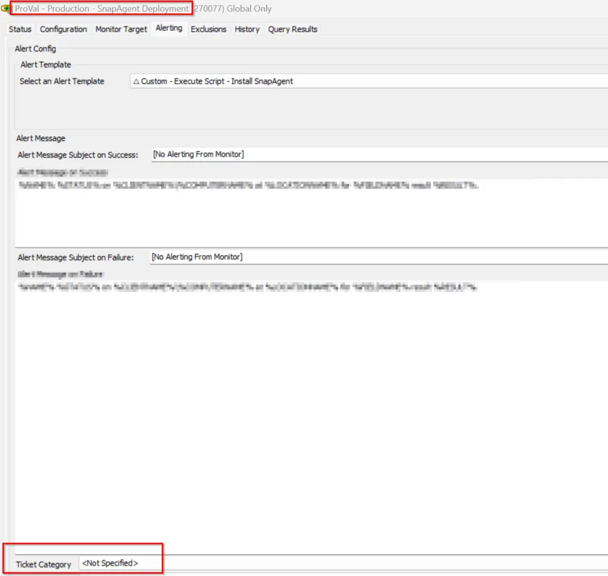

## Summary

This monitor detects online Windows agents where the SnapAgent is not installed.

It also depends on the following EDFs:
- **BlackPoint SNAP URL**: The Client EDF should contain the URL of the installer package downloader.
- **BlackPoint SnapAgent Deploy**: The Client EDF should be checked for deployment confirmation.
- **BlackPoint SnapAgent Deploy Exclude**: The location EDF should not be checked for deployment; otherwise, agents from those locations will be excluded.
- **BlackPoint SnapAgent Exclude**: The computer EDF should not be checked for deployment; otherwise, the agent will be excluded.

## Dependencies

[CWA - Script - SnapAgent Installer](/docs/202e2dde-5865-4035-8410-37dc6cb92a60)

## Target

Global

## Ticketing

- The ticket is controlled by the script "SnapAgent Installer."
- To enable the ticketing feature, it is mandatory to set the ticket category at the monitor level, as shown below:

