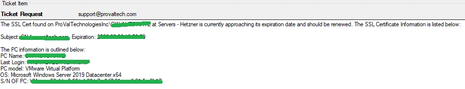

## Summary

This monitor looks at the proval_plugin_certs table (generated through the Import SSL Certificates into CWA [Custom Table] script) for any SSL certificates that have an expiration date of fewer than 30 days. This solution is effective for catching machines that may have been missed and do not have active reminders in place for certificate renewals. Additionally, the difference between the certification addition and expiration should be at least 30 days to trigger an alert.

**Alert Template:** △ Custom - Ticket Creation - Computer

## Implementation

To exclude self-signed, Microsoft-generated certificates, and any certificate with a GUID in the Subject, uncomment the following lines in the Additional Condition. Before adding any exclusions, it is recommended to review the [EPM - Network - Dataview - SSL Certificate Audit](/docs/8cca4422-d71b-4696-b5d8-8cbc51158b3d) dataview to ensure that enabling these exclusions will not omit any important certificates.


## Dependencies

This monitor is dependent on the following items:
- [EPM - Network - Script - Certificate - Windows - Certificates (My) - Local Machine - Audit](/docs/7d13a122-8d62-4c50-b19f-922e6bb37a13)  
- [EPM - Network - Custom Table - plugin_proval_certs](/docs/44048760-bd04-451d-82ea-b6eee6a03552)  
- [CWM - Automate - Script - Ticket Creation - Computer](/docs/63beba3c-f4a6-41a5-98e2-d4e4ce885035) (not required, but creates more detailed tickets)

## Target

Global

## Ticketing

**Subject:**  
```
SSL Cert Expiration < 30 Days - %computername%
```

**Message on Failure:**  
```
The SSL Cert found on %CLIENTNAME%/%COMPUTERNAME% at %LOCATIONNAME% is currently approaching its expiration date and should be renewed. The SSL Certificate Information is listed below:

%FIELDNAME%
```

**Message on Success:**  
```
The SSL Cert found on %CLIENTNAME%/%COMPUTERNAME% at %LOCATIONNAME% is no longer reporting any issues with expiration. Closing ticket.
```

**%FIELDNAME% Example:**  
```
Subject: CN=remote.something.com
Expiration: 2023-04-20 19:59:59
```

## Example Ticket


