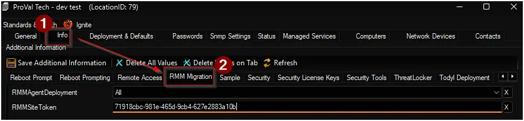

## Summary

Detect machines where CW RMM agent deployment is enabled but agent is not installed.

## Dependencies

- [CW RMM Agent Deployment](/docs/f3f03288-5bce-4fb7-8a32-1ea41d698197)
- [Solution - CW RMM Migration](/docs/c8f1104e-7934-408f-a35d-9279a0d5f7e1)

## Target

`Global`

## Location Level EDFs

| Name | Example | Section | Required | Type | Accepted Values | Description |
| ---- | ------- | ------- | -------- | ---- | --------------- | ----------- |
| RMMAgentDeployment | `All` | RMM Migration | True | Drop-down | <ul><li>Not Set</li><li>Workstations</li><li>Servers</li><li>All</li></ul> | Select the operating system to deploy CW RMM agent upon. |
| RMMSiteToken | `71918cbc-981e-465d-9cb4-627e2883a10b` | RMM Migration | True | Text | | CW RMM Agent token for the site. |

## Alert Template

- `△ Custom - Execute Script - CW RMM Agent Deployment`
