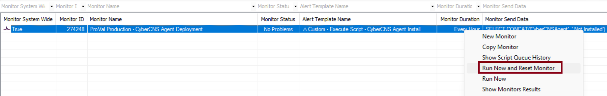
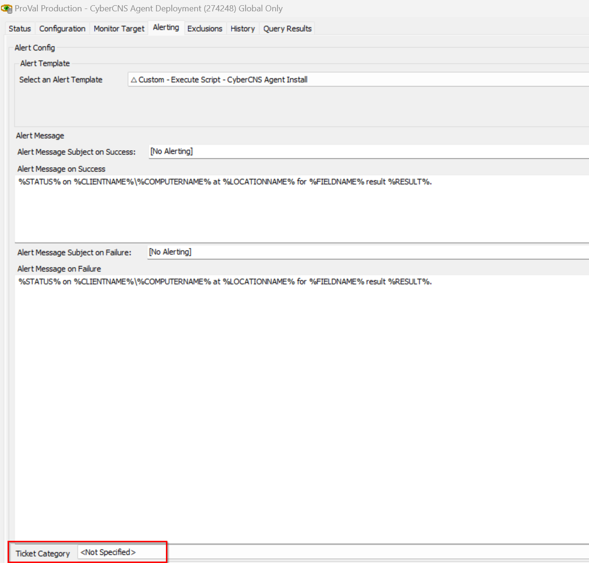

## Summary

This monitor detects the online Automate agent where the CyberCNS Company ID is provided, and attempts to deploy the CyberCNS agent on it.

## Dependencies

- [Script - CyberCNS Agent Installation](/docs/15ecac3c-fe43-4d04-9e6c-82099bfa356b)
- [Solution - CyberCNS Agent](/docs/f68fc157-ae00-4c3f-bb05-b53cefab28ac)

## Target

- Global

## Implementation

- Import the monitor
- Import the alert template `△ Custom - Execute Script - CyberCNS Agent Install`
- Apply the alert template to the monitor
- Right click on monitor and then click the Run now and reset the monitor
 

## TicketCreation

- To allow creating ticket for the failed attempt of the CyberCNS deployment please set the `Ticket Category` in the Alerting section of the monitor.

  