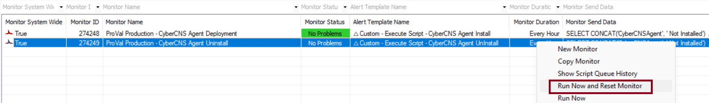

## Summary

This monitor detects the online Automate agent where the CyberCNS Agent is installed, and attempts to uninstall the CyberCNS agent from it.

## Dependencies

- [Script - Cybercns Agent Uninstallation](/docs/d4e3e9b3-bdf1-404a-9db0-2c4be4468a5d)
- [Solution - CyberCNS Agent](/docs/f68fc157-ae00-4c3f-bb05-b53cefab28ac)

## Target

- Global

## Implementation

- Import the monitor
- Import the alert template `△ Custom - Execute Script - CyberCNS Agent Uninstall`
- Apply the alert template to the monitor
- Right click on monitor and then click the Run now and reset the monitor
 
  

## Changelog

 ### 2026-03-12

 - Initial version of the document