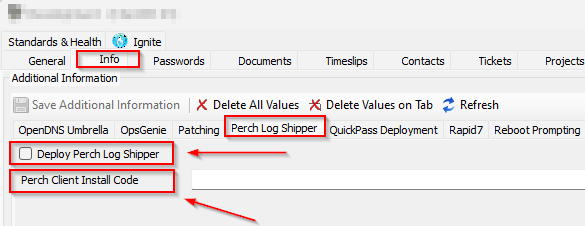
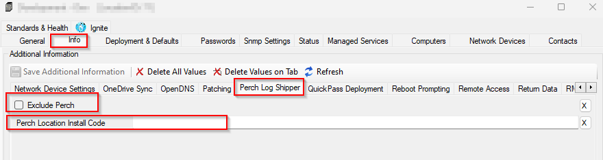
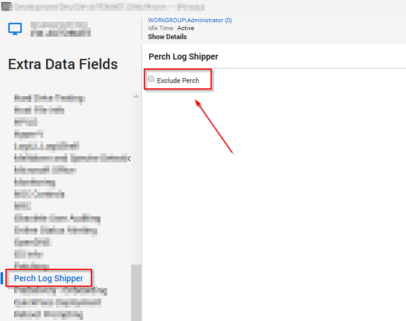

## Summary

This monitor detects Windows machines that are missing the Perch Log Shipper. To initiate the installation on targeted client machines, the client-level EDF `Deploy Perch Log Shipper` must be checked, and either the client-level EDF `Perch Client Install Code` or the location-level EDF `Perch Location Install Code` must be populated with the installation code at the client level.

## Dependencies

- [SWM - Software Install - Script - Deploy Perch Log Shipper](/docs/6587bacd-7587-466e-b31d-7291cf11a401)  
- Client-Level EDFs to select Perch Log Shipper Deployment and to populate the installation token  
    
- Location-level EDF to exclude a location from Perch Log Shipper Deployment and to populate the installation token  
    
- Computer-level EDF to exclude a computer from Perch Log Shipper Deployment  
    

## Target

Windows Machines

## Alert Template

- `△ Custom - Execute Script - Deploy Perch Log Shipper`

