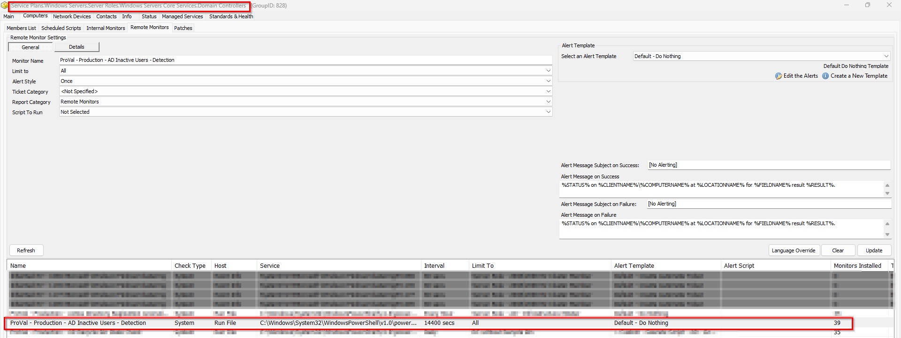

## Summary

This is a remote monitor that detects inactive AD Users over 90 days.

## Details

- **Suggested "Limit to"**: `All`
- **Suggested Alert Style**: `Once`
- **Suggested Alert Template**: `△ Custom - Execute Script - Disable Inactive AD Users`

| Check Action | Server Address | Check Type | Comparator | Interval | Result |
| ------------ | -------------- | ---------- | ---------- | -------- | ------ |
|  System            | 127.0.0.1               | Run File           | Contains           |  14400        |  No inactive account detected      |

## Dependencies

**Alert Template:** `△ Custom - Execute Script - Disable Inactive AD Users`
- [Table - pvl_ad_inactive_users](/docs/2b118df6-1fef-4530-9303-0bb56c478361)
- [Script - Disable - AD Inactive Users - X Days](/docs/b793791e-2305-4ac5-ace3-b5737368190e)
- [Solution- Inactive AD Users Disable/Enable](/docs/d93ff68b-9515-4d4c-bfa4-ff551b3eac37)

## Target

- Domain Controller Group

## Implementation

- Execute the [Script - Disable - AD Inactive Users - X Days](/docs/b793791e-2305-4ac5-ace3-b5737368190e) with `SetEnvironment` = 1 during import to ensure the custom table "pvl_ad_inactive_users" is built and the remote monitor "ProVal - Production - AD Inactive Users - Detection" is created for the domain controller group with `Default - Do nothing` template.
- Confirm the remote monitor is created to the group `Domain Controller`

- After confirmation from the partner apply the `Alert Template - △ Custom - Execute Script - Disable Inactive AD Users` to the remote monitor so that it can disable inactive account above 90 days using [Script - Disable - AD Inactive Users - X Days](/docs/b793791e-2305-4ac5-ace3-b5737368190e)