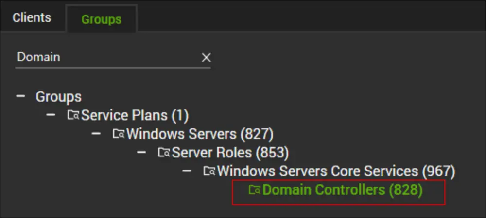
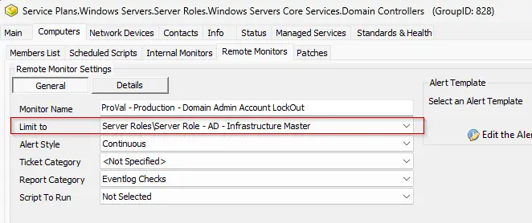
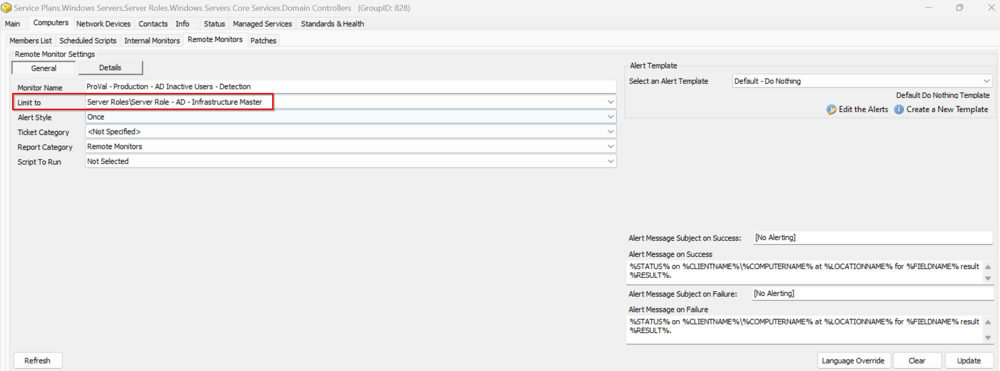

## Summary

This is a remote monitor that detects inactive AD Users over 90 days.

## Details

- **Suggested "Limit to"**: `Server Roles/Server Role - AD - Infrastructure Master`
- **Suggested Alert Style**: `Once`
- **Suggested Alert Template**: `△ Custom - Execute Script - Disable Inactive AD Users`


| Check Action | Server Address | Check Type | Comparator | Interval | Result |
| ------------ | -------------- | ---------- | ---------- | -------- | ------ |
|  System            | 127.0.0.1               | Run File           | Contains           |  14400        |  No inactive account detected      |

## Dependencies

- **Alert Template:** `△ Custom - Execute Script - Disable Inactive AD Users`
- [Table - pvl_ad_inactive_users](/docs/2b118df6-1fef-4530-9303-0bb56c478361)
- [Script - Disable - AD Inactive Users - X Days](/docs/b793791e-2305-4ac5-ace3-b5737368190e)
- [Solution- Inactive AD Users Disable/Enable](/docs/d93ff68b-9515-4d4c-bfa4-ff551b3eac37)

## Target

- Domain Controller Group
  
  

The monitor set should be limited to the `Server Roles/Server Role - AD - Infrastructure Master` search.

## Implementation

- Validate that the [Script - Disable - AD Inactive Users - X Days](/docs/b793791e-2305-4ac5-ace3-b5737368190e) was imported.
- Import the `Alert Template - △ Custom - Execute Script - Disable Inactive AD Users`
- Run the below SQL Query
  
```sql
SET @Groupid = (SELECT Groupid From MasterGroups where `GUID` =  '3ac455da-f1fb-11e1-b4ec-1231391d2d19' ) ;
SET @Searchid = (SELECT sensid FROM sensorchecks WHERE `GUID` = '430a4640-9c97-4344-bfe8-7a786b110729');

INSERT INTO groupagents 
SELECT '' as `AgentID`,
`groupid` as `GroupID`,
@Searchid as `SearchID`,
'ProVal - Production - AD Inactive Users - Detection' as `Name`,
'6' as `CheckAction`,
'1' as `AlertAction`,
'[No Alerting]~~~%STATUS% on %CLIENTNAME%\\%COMPUTERNAME% at %LOCATIONNAME% for %FIELDNAME% result %RESULT%.!!![No Alerting]~~~%STATUS% on %CLIENTNAME%\\%COMPUTERNAME% at %LOCATIONNAME% for %FIELDNAME% result %RESULT%.' as `AlertMessage`,
'0' as `ContactID`,
'14400' as `interval`,
'127.0.0.1' as `Where`,
'7' as `What`,
'C:\\Windows\\System32\\WindowsPowerShell\\v1.0\\powershell.exe -ExecutionPolicy Bypass -Command "try { Import-Module ActiveDirectory; $thresholdDate = (Get-Date).AddDays(-90); $users = Get-ADUser -Filter {Enabled -eq $true -and ObjectClass -eq \'user\'} -Properties LastLogonDate | Where-Object { $_.SamAccountName -notmatch \'^(Administrator|Guest|krbtgt|DefaultAccount|.*\\$)\' }; $inactiveFound = $false; foreach ($user in $users) { if ($user.LastLogonDate -lt $thresholdDate -or -not $user.LastLogonDate) { $inactiveFound = $true } }; if (-not $inactiveFound) { Write-Output \'No inactive account detected\' } else { Write-Output \'Inactive Account Found\' } } catch { Write-Output \'PowerShell execution failed\' }"' as `DataOut`,
'5' as `Comparor`,
'No inactive account detected' as `DataIn`,
'0' as `IDField`,
'1' as `AlertStyle`,
'0' as `ScriptID`,
'' as `datacollector`,
'16' as `Category`,
'0' as `TicketCategory`,
'1' as `ScriptTarget`,
CONCAT(
SUBSTRING('abcdef0123456789', FLOOR(RAND()*16+1), 1),
SUBSTRING('abcdef0123456789', FLOOR(RAND()*16+1), 1),
SUBSTRING('abcdef0123456789', FLOOR(RAND()*16+1), 1),
SUBSTRING('abcdef0123456789', FLOOR(RAND()*16+1), 1),
SUBSTRING('abcdef0123456789', FLOOR(RAND()*16+1), 1),
SUBSTRING('abcdef0123456789', FLOOR(RAND()*16+1), 1),
SUBSTRING('abcdef0123456789', FLOOR(RAND()*16+1), 1),
SUBSTRING('abcdef0123456789', FLOOR(RAND()*16+1), 1),
'-',
SUBSTRING('abcdef0123456789', FLOOR(RAND()*16+1), 1),
SUBSTRING('abcdef0123456789', FLOOR(RAND()*16+1), 1),
SUBSTRING('abcdef0123456789', FLOOR(RAND()*16+1), 1),
SUBSTRING('abcdef0123456789', FLOOR(RAND()*16+1), 1),
'-',
SUBSTRING('abcdef0123456789', FLOOR(RAND()*16+1), 1),
SUBSTRING('abcdef0123456789', FLOOR(RAND()*16+1), 1),
SUBSTRING('abcdef0123456789', FLOOR(RAND()*16+1), 1),
SUBSTRING('abcdef0123456789', FLOOR(RAND()*16+1), 1),
'-',
SUBSTRING('abcdef0123456789', FLOOR(RAND()*16+1), 1),
SUBSTRING('abcdef0123456789', FLOOR(RAND()*16+1), 1),
SUBSTRING('abcdef0123456789', FLOOR(RAND()*16+1), 1),
SUBSTRING('abcdef0123456789', FLOOR(RAND()*16+1), 1),
'-',
SUBSTRING('abcdef0123456789', FLOOR(RAND()*16+1), 1),
SUBSTRING('abcdef0123456789', FLOOR(RAND()*16+1), 1),
SUBSTRING('abcdef0123456789', FLOOR(RAND()*16+1), 1),
SUBSTRING('abcdef0123456789', FLOOR(RAND()*16+1), 1),
SUBSTRING('abcdef0123456789', FLOOR(RAND()*16+1), 1),
SUBSTRING('abcdef0123456789', FLOOR(RAND()*16+1), 1),
SUBSTRING('abcdef0123456789', FLOOR(RAND()*16+1), 1),
SUBSTRING('abcdef0123456789', FLOOR(RAND()*16+1), 1),
SUBSTRING('abcdef0123456789', FLOOR(RAND()*16+1), 1),
SUBSTRING('abcdef0123456789', FLOOR(RAND()*16+1), 1),
SUBSTRING('abcdef0123456789', FLOOR(RAND()*16+1), 1),
SUBSTRING('abcdef0123456789', FLOOR(RAND()*16+1), 1)
) as `GUID`,
'root' as `UpdatedBy`,
(NOW()) as `UpdateDate`
FROM mastergroups m
WHERE m.groupid = @Groupid
AND m.groupid NOT IN  (SELECT DISTINCT groupid FROM groupagents WHERE `Name` = 'ProVal - Production - AD Inactive Users - Detection') ;
```

- 
  Check the `Domain Controllers` group and ensure that the monitor set is created and configured with the correct search.
  Limit To: `Server Role - AD - Infrastructure Master`

  

    

- 
  Assign the required alert template. It is suggested to use `△ Custom - Execute Script - Disable Inactive AD Users` for the best results.
