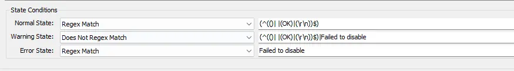
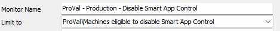

---  
id: '59d4d082-1d52-4d3f-a070-e327be384177'
slug: /59d4d082-1d52-4d3f-a070-e327be384177
title: 'Disable Smart App Control'
title_meta: 'Disable Smart App Control'
keywords: ['windows','Disable','Smart','Control']
description: 'This monitor disables the `Smart App Control` on Windows 11 22H2 and later machines.'
tags: ['setup', 'windows']
draft: false
unlisted: false
last_update:
  date: 2026-05-06
---

## Summary

This monitor disables the `Smart App Control` on Windows 11 22H2 and later machines.

## Details

**Suggested "Limit to"**: `Windows 11 22H2 and later`  
**Suggested Alert Style**: `Once`  
**Suggested Alert Template**: `-`

| Check Action | Server Address | Check Type | Execute Info | Comparator | Interval | Result            |
|--------------|----------------|------------|---------------|------------|----------|-------------------|
| System       | 127.0.0.1     | Run File   | **REDACTED**  | State Based | 3600      | \<Screenshot Below> |

## Target

- Windows Workstations
- The monitor set should be limited to the `Machines eligible to disable Smart App Control` search. 

## How To Import

[Import - Remote Monitor - Disable Smart App Control](/docs/c73ce05c-fd6a-47fa-a6e5-79cdb11418cf)

## Changelog

### 2026-05-06

- Initial version of the document