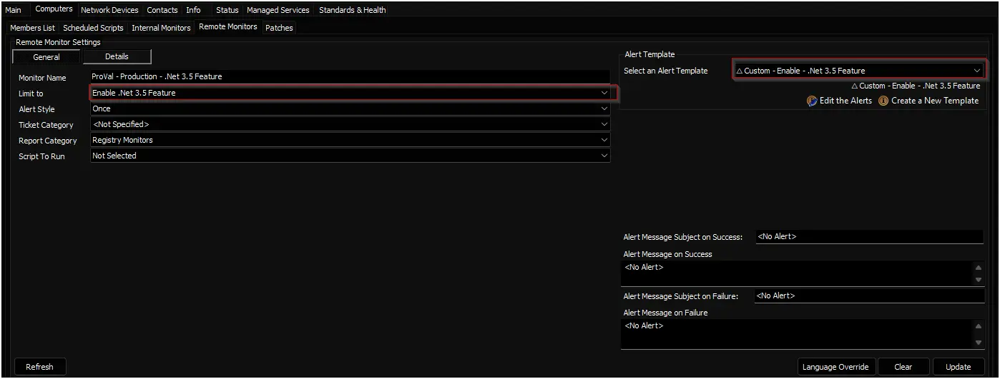

## Summary

This monitor verifies the installation status of the .NET Framework 3.5 feature on Windows 10 and Windows 11 workstations. It executes a PowerShell check for the 'NetFx3' feature state. If the feature is disabled, the monitor returns a 'Compliance Failure' alert, which triggers the associated autofix action to install the framework

## Details

**Suggested "Limit to"**: `Enable .Net 3.5 Feature`  
**Suggested Alert Style**: `Once`  
**Suggested Alert Template**: `△ Custom - Enable - .Net 3.5 Feature`

| Check Action | Server Address | Check Type | Comparator | Interval | Result |
| ------------ | -------------- | ---------- | ---------- | -------- | ------ |
|  System      | 127.0.0.1      |  Run File  | Does Not Contain | 86400 | `Compliance Failure:` |

## Dependencies

- [Script: Enable .Net 3.5 Feature [Windows Workstations]](/docs/31e2b232-f0b1-11f0-be0d-92000234cfc2)
- [Solution: Enable .Net 3.5](/docs/5d596cd8-3e9d-4a03-a610-ec85f8a9fb19)

## Target

Managed Windows Workstations

## Implementation

### Step 1

Import the Alert Template `△ Custom - Enable - .Net 3.5 Feature` from ProSync plugin.

### Step 2

Run this SQL query from a RAWSQL monitor set to import the required search:

```Sql
INSERT INTO `sensorchecks` (`Name`, `SQL`, `QueryType`, `ListDATA`, `FolderID`, `GUID`, `SearchXML`)
SELECT
    'Enable .Net 3.5 Feature',
    'SELECT \r\n   computers.computerid as `Computer Id`,\r\n   computers.name as `Computer Name`,\r\n   clients.name as `Client Name`,\r\n   computers.domain as `Computer Domain`,\r\n   computers.username as `Computer User`,\r\n   IFNULL(IFNULL(edfAssigned1.Value,edfDefault1.value),\'0\') as `Computer - Client - Extra Data Field - Automation - Enable  - Net 3 - 5 Feature`,\r\n   IFNULL(IFNULL(edfAssigned2.Value,edfDefault2.value),\'0\') as `Computer - Location - Extra Data Field - Exclusions -  - Net 3 - 5 Feature - Exclusion`,\r\n   IFNULL(IFNULL(edfAssigned3.Value,edfDefault3.value),\'0\') as `Computer - Extra Data Field - Exclusions -  - Net 3 - 5 Feature - Exclusion`,\r\n   inv_operatingsystem.name as `Computer.OS.Name`\r\nFROM Computers \r\nLEFT JOIN inv_operatingsystem ON (Computers.ComputerId=inv_operatingsystem.ComputerId)\r\nLEFT JOIN Clients ON (Computers.ClientId=Clients.ClientId)\r\nLEFT JOIN Locations ON (Computers.LocationId=Locations.LocationID)\r\nLEFT JOIN ExtraFieldData edfAssigned1 ON (edfAssigned1.id=Clients.ClientId and edfAssigned1.ExtraFieldId =(Select ExtraField.id FROM ExtraField WHERE LTGuid=\'2f62be2d-b647-49ba-a6f5-285331fce078\'))\r\nLEFT JOIN ExtraFieldData edfDefault1 ON (edfDefault1.id=0 and edfDefault1.ExtraFieldId =(Select ExtraField.id FROM ExtraField WHERE LTGuid=\'2f62be2d-b647-49ba-a6f5-285331fce078\'))\r\nLEFT JOIN ExtraFieldData edfAssigned2 ON (edfAssigned2.id=Locations.LocationId and edfAssigned2.ExtraFieldId =(Select ExtraField.id FROM ExtraField WHERE LTGuid=\'958391f6-5501-42ac-991e-65af8a5b3463\'))\r\nLEFT JOIN ExtraFieldData edfDefault2 ON (edfDefault2.id=0 and edfDefault2.ExtraFieldId =(Select ExtraField.id FROM ExtraField WHERE LTGuid=\'958391f6-5501-42ac-991e-65af8a5b3463\'))\r\nLEFT JOIN ExtraFieldData edfAssigned3 ON (edfAssigned3.id=Computers.ComputerId and edfAssigned3.ExtraFieldId =(Select ExtraField.id FROM ExtraField WHERE LTGuid=\'2c30a38c-7f5b-47fd-a3f6-1a651328313d\'))\r\nLEFT JOIN ExtraFieldData edfDefault3 ON (edfDefault3.id=0 and edfDefault3.ExtraFieldId =(Select ExtraField.id FROM ExtraField WHERE LTGuid=\'2c30a38c-7f5b-47fd-a3f6-1a651328313d\'))\r\n WHERE \r\n((((IFNULL(IFNULL(edfAssigned1.Value,edfDefault1.value),\'0\')<>0) AND (IFNULL(IFNULL(edfAssigned2.Value,edfDefault2.value),\'0\')=0) AND (IFNULL(IFNULL(edfAssigned3.Value,edfDefault3.value),\'0\')=0) AND (((inv_operatingsystem.name like \'%Windows 11%\') OR (inv_operatingsystem.name like \'%Windows 10%\'))))))\r\n',
    4,
    'Select||=||=||=|^Select|||||||^',
    0,
    '964ceefc-09bf-4a62-9c37-fe95376607f3',
    '<LabTechAbstractSearch><asn><st>AndNode</st><cn><asn><st>AndNode</st><cn><asn><st>ComparisonNode</st><lon>Computer.Client.Extra Data Field.Automation.Enable .Net 3.5 Feature</lon><lok>Computer.Client.Edf.2f62be2d-b647-49ba-a6f5-285331fce078</lok><lmo>IsTrue</lmo><dv>NULL</dv><dk>NULL</dk></asn><asn><st>ComparisonNode</st><lon>Computer.Location.Extra Data Field.Exclusions..Net 3.5 Feature - Exclusion</lon><lok>Computer.Location.Edf.958391f6-5501-42ac-991e-65af8a5b3463</lok><lmo>IsFalse</lmo><dv>NULL</dv><dk>NULL</dk></asn><asn><st>ComparisonNode</st><lon>Computer.Extra Data Field.Exclusions..Net 3.5 Feature - Exclusion</lon><lok>Computer.Edf.2c30a38c-7f5b-47fd-a3f6-1a651328313d</lok><lmo>IsFalse</lmo><dv>NULL</dv><dk>NULL</dk></asn><asn><st>OrNode</st><cn><asn><st>ComparisonNode</st><lon>Computer.OS.Name</lon><lok>Computer.OS.Name</lok><lmo>TextLike</lmo><dv>%Windows 11%</dv><dk>%Windows 11%</dk></asn><asn><st>ComparisonNode</st><lon>Computer.OS.Name</lon><lok>Computer.OS.Name</lok><lmo>TextLike</lmo><dv>%Windows 10%</dv><dk>%Windows 10%</dk></asn></cn></asn></cn></asn></cn></asn></LabTechAbstractSearch>'
FROM
    (SELECT MIN(computerid) FROM computers) a
WHERE
    (SELECT COUNT(*) FROM SensorChecks WHERE `GUID` = '964ceefc-09bf-4a62-9c37-fe95376607f3') = 0;
```

### Step 3

Obtain the group ID(s) of the group(s) that the remote monitor should be applied to.

### Step 4

Copy the following query and replace **YOUR COMMA SEPARATED LIST OF GROUPID(S)** with the group ID(s) of the relevant groups. (The string to replace can be found at the very bottom of the query, right after **WHERE**).

```sql
SET @searchid = (SELECT sensid FROM sensorchecks WHERE `GUID` = '964ceefc-09bf-4a62-9c37-fe95376607f3');
SET @alertaction = (SELECT min(alertactionid) from alerttemplate where `Guid` = 'd7b0ca24-8152-400b-8534-6902f5fd9143');
INSERT INTO 
    groupagents 
SELECT 
    '' as `AgentID`,
    `groupid` as `GroupID`,
    @searchid as `SearchID`,
    'ProVal - Production - .Net 3.5 Feature' as `Name`,
    @alertaction as `CheckAction`,
    '787' as `AlertAction`,
    '<No Alert>~~~<No Alert>!!!<No Alert>~~~<No Alert>' as `AlertMessage`,
    '0' as `ContactID`,
    '86400' as `interval`,
    '127.0.0.1' as `Where`,
    '7' as `What`,
    'C:\\Windows\\System32\\WindowsPowerShell\\v1.0\\powershell.exe -ExecutionPolicy Bypass -Command "$ProgressPreference = \'SilentlyContinue\'; $state = (Get-WindowsOptionalFeature -Online -FeatureName \'NetFx3\' -ErrorAction SilentlyContinue).State; if ($state -eq \'Enabled\') { \'Status OK: .NET Framework 3.5 is enabled.\' } else { return (\'Compliance Failure: .NET Framework 3.5 is not enabled. Current state is \'\'{0}\'\'.\' -f $state) }"' as `DataOut`,
    '9' as `Comparor`,
    'Compliance Failure:' as `DataIn`,
    '' as `IDField`,
    '1' as `AlertStyle`,
    '0' as `ScriptID`,
    '' as `datacollector`,
    '21' as `Category`,
    '0' as `TicketCategory`,
    '1' as `ScriptTarget`,
    (UUID()) as `GUID`,
    'root' as `UpdatedBy`,
    (NOW()) as `UpdateDate`
FROM 
    mastergroups m
WHERE 
    m.groupid IN (YOUR COMMA SEPARATED LIST OF GROUPID(S))
    AND m.groupid NOT IN  (
        SELECT 
            DISTINCT groupid
        FROM 
            groupagents
        WHERE 
            `Name` = 'ProVal - Production - .Net 3.5 Feature'
        );
```

### Step 5

An example of the query with group IDs and modified thresholds:

```sql
SET @searchid = (SELECT sensid FROM sensorchecks WHERE `GUID` = '964ceefc-09bf-4a62-9c37-fe95376607f3');
SET @alertaction = (SELECT min(alertactionid) from alerttemplate where `Guid` = 'd7b0ca24-8152-400b-8534-6902f5fd9143');
INSERT INTO 
    groupagents 
SELECT 
    '' as `AgentID`,
    `groupid` as `GroupID`,
    @searchid as `SearchID`,
    'ProVal - Production - .Net 3.5 Feature' as `Name`,
    @alertaction as `CheckAction`,
    '787' as `AlertAction`,
    '<No Alert>~~~<No Alert>!!!<No Alert>~~~<No Alert>' as `AlertMessage`,
    '0' as `ContactID`,
    '86400' as `interval`,
    '127.0.0.1' as `Where`,
    '7' as `What`,
    'C:\\Windows\\System32\\WindowsPowerShell\\v1.0\\powershell.exe -ExecutionPolicy Bypass -Command "$ProgressPreference = \'SilentlyContinue\'; $state = (Get-WindowsOptionalFeature -Online -FeatureName \'NetFx3\' -ErrorAction SilentlyContinue).State; if ($state -eq \'Enabled\') { \'Status OK: .NET Framework 3.5 is enabled.\' } else { return (\'Compliance Failure: .NET Framework 3.5 is not enabled. Current state is \'\'{0}\'\'.\' -f $state) }"' as `DataOut`,
    '9' as `Comparor`,
    'Compliance Failure:' as `DataIn`,
    '' as `IDField`,
    '1' as `AlertStyle`,
    '0' as `ScriptID`,
    '' as `datacollector`,
    '21' as `Category`,
    '0' as `TicketCategory`,
    '1' as `ScriptTarget`,
    (UUID()) as `GUID`,
    'root' as `UpdatedBy`,
    (NOW()) as `UpdateDate`
FROM 
    mastergroups m
WHERE 
    m.groupid IN (2,3)
    AND m.groupid NOT IN  (
        SELECT 
            DISTINCT groupid
        FROM 
            groupagents
        WHERE 
            `Name` = 'ProVal - Production - .Net 3.5 Feature'
        );
```

### Step 6

Check the concerned groups and ensure the monitor set is created and configured with the correct search and alert template.
**Limit to:** `Enable .Net 3.5 Feature`  
**Alert Template:** `△ Custom - Enable - .Net 3.5 Feature`  

