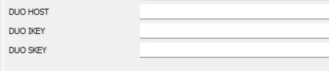
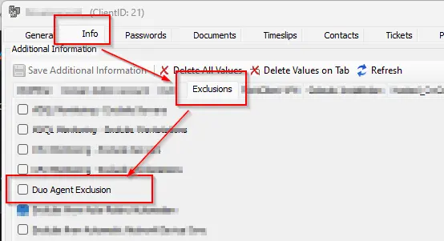
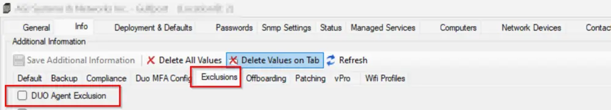
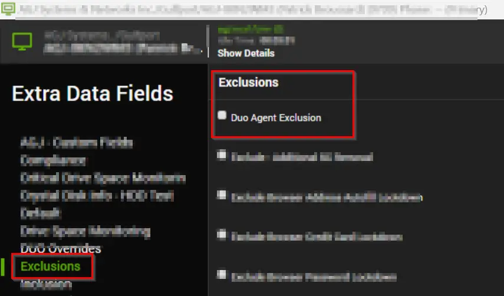
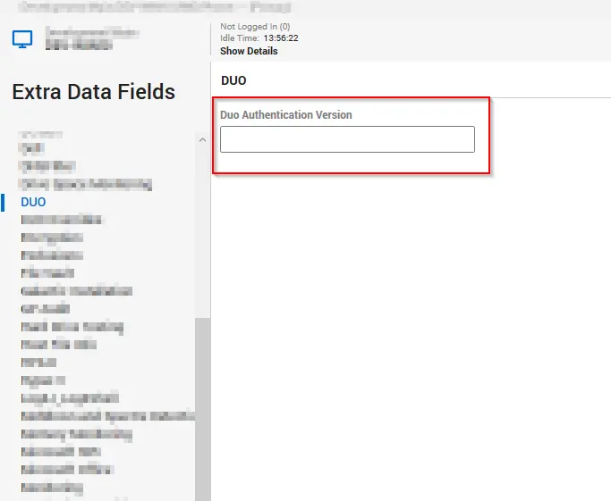

## Summary

This monitor detects online Windows agents where outdated DUO Authentication for Windows Logon is installed. It also identifies agents whose client EDFs are set with specific values and those where the exclusion EDF "DUO Agent Exclusion" is not checked at the location or computer level.

### Client EDFs:

### Client Exclusion EDF:  
****  

### Location Exclusion EDFs:

### Computer Exclusion EDFs:

### Script EDFs:

  

## Dependencies

[Script - DUO Install/Upgrade - Latest Version](/docs/99a31695-f399-4982-989b-5fbc3aada8c6)

## Target

Windows OS

## Ticketing

---

**Subject:**  
DUO Authentication Install/Update Failed on %ComputerName% at %ClientName%

---

**Body**

**When installation fails:**  
Failed to install the @ApplicationVersion@ of DUO Authentication for Windows Logon. Here's the result of the installation command: %ShellResult%

**When an argument is missing:**  
Arguments required to install DUO Authentication for Windows Logon are not set.