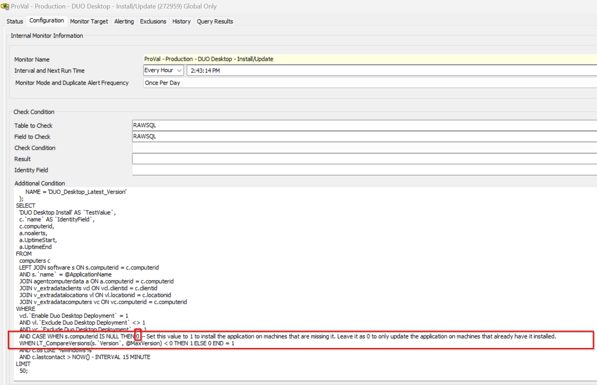

## Summary
This internal monitor is built to upgrade the DUO Desktop every month if a newer version is released. It also provides an option to install the application with the upgrade.
It depends on the EDFs and System property.

#### EDF

| **Name**                        | **Type** | **Level**  | **Example** | **Required** | **Description**                                                                                   |
|---------------------------------|----------|------------|-------------|--------------|---------------------------------------------------------------------------------------------------|
| **Enable Duo Desktop Deployment** | Flag     | Client     | 1 or 0       | True         | The agents will start getting the auto-deployment of the DUO Desktop only if this flag is checked. |
| **Exclude DUO Desktop Deployment** | Flag     | Location   | 1 or 0       | False        | If checked, the agents at that location will be excluded from the DUO Desktop deployment.         |
| **Exclude DUO Desktop Deployment** | Flag     | Computer   | 1 or 0       | False        | If checked, the  computer will be excluded from the DUO Desktop deployment.         |

#### System Properties

| **Name**                    | **Value** | **Description**                                                       |
|-----------------------------|-----------|------------------------------------------------------------------------|
| **DUO_Desktop_Latest_Version** | 7.6.0     | Stores the latest version of the DUO Desktop application.              |

## Dependencies

[Script - DUO Desktop - Install/Upgrade](/docs/c0019fe0-7411-4c3d-981b-f2bb70733c26)  
[Solution - DUO Desktop Deployment Solution](/docs/8adb49f7-d8be-4725-a136-bc59e185743c)  
**Alert Template** - △ Custom - Execute Script - DUO Desktop

## Target

- Global

## Implementation

- Import the Monitor
- Import the [Script - DUO Desktop - Install/Upgrade](/docs/c0019fe0-7411-4c3d-981b-f2bb70733c26)
- Import the **Alert Template - △ Custom - Execute Script - DUO Desktop**
- Navigate to the Automation->Monitors
- Apply the **Alert Template - △ Custom - Execute Script - DUO Desktop** with the monitor to run the [Script - DUO Desktop - Install/Upgrade](/docs/c0019fe0-7411-4c3d-981b-f2bb70733c26) as an autofix.
- Run now and reset the monitor.

## FAQ

- How to enable the installation part of the monitor
- The monitor 0 value need to be changed with 1 to set the auto-deployment installation and update both.
By default, the monitor only works for the update.