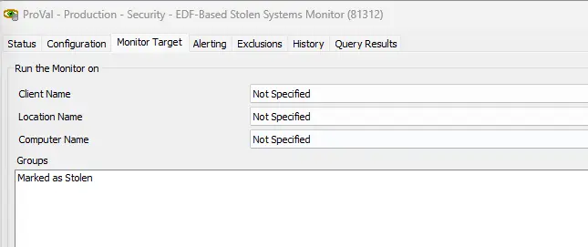

## Summary

This document executes the [SEC - Encryption - Script - Lock Stolen System](/docs/3fec514c-c0b2-4b19-92b7-d77c78e678a3) script against the machines where the `Mark System As Stolen` EDF is marked and initiates monitoring through Automate.

## Dependencies

- [SEC - Encryption - Script - Lock Stolen System](/docs/3fec514c-c0b2-4b19-92b7-d77c78e678a3)

## Target

- `Marked as Stolen` Group

