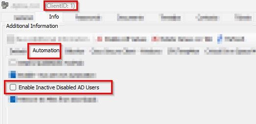

## Summary

This internal monitor detects the AD Infrastructure Master servers where the client-EDF `Enable Inactive Disabled AD Users` is enabled and has a disabled users list in the [Table - pvl_ad_inactive_users](/docs/2b118df6-1fef-4530-9303-0bb56c478361). It then runs the [Script - Enable - Inactive Disabled AD Users - X Days](/docs/7694a01e-f449-40e0-8982-0c351509257a) as an auto-fix to enable the detected accounts.

## Dependencies

- [Script - Enable - Inactive Disabled AD Users - X Days](/docs/7694a01e-f449-40e0-8982-0c351509257a)
- **Alert Template:** `△ Custom - Execute Script - Activate Disabled AD Users`
- [Table - pvl_ad_inactive_users](/docs/2b118df6-1fef-4530-9303-0bb56c478361)
- [Solution - Inactive AD Users Disable/Enable](/docs/d93ff68b-9515-4d4c-bfa4-ff551b3eac37)

## Target

- AD Infrastructure Master Server

## Implementation

- Import the monitor `ProVal Production - Enable Inactive Disabled AD Users`.
- Ensure the [Script - Enable - Inactive Disabled AD Users - X Days](/docs/7694a01e-f449-40e0-8982-0c351509257a) is imported.
- Import the  `Alert Template - △ Custom - Execute Script - Activate Disabled AD Users`
- Enable the client EDF:  
  
- Apply the alert template `△ Custom - Execute Script - Activate Disabled AD Users` to the monitor that calls the [Script - Enable - Inactive Disabled AD Users - X Days](/docs/7694a01e-f449-40e0-8982-0c351509257a) to enable the detected accounts.